# 개요
진행 중인 투자 라운드에 긴급 자금을 투입한다.

# 목적
- 라운드 중 자금 부족 상황에서 제한된 범위 내 추가 자금을 공급한다.
- 긴급 투입 이력을 기록하여 랭킹/복기 계산(총 투입금)에 반영할 수 있게 한다.

# 선행 구현 사항
## 라운드 필드
- `INVESTMENT_ROUND.emergency_funding_limit`: 1회 투입 상한
- `INVESTMENT_ROUND.emergency_charge_count`: 잔여 투입 횟수
- 라운드 시작 시 `emergency_charge_count = 3`으로 초기화된다.

## 지갑 생성 정책
- 라운드 시작 시 `seeds`에 포함된 거래소별로 지갑이 생성된다.
- `wallet` 테이블은 `(round_id, exchange_id)` 유니크 제약(`uk_wallet_round_exchange`)이 있다.
- 긴급 자금은 `walletId`를 직접 받지 않고 `roundId + exchangeId`로 대상 지갑을 식별한다.

# 도메인 규칙
- 본인 라운드만 긴급 자금 투입이 가능하다.
- 라운드 상태가 `ACTIVE`여야 한다.
- `emergencyFundingLimit == 0`이면 긴급 자금 기능을 비활성으로 간주한다.
- `emergencyChargeCount > 0`이어야 한다.
- 투입 금액은 `0 < amount <= emergencyFundingLimit`를 만족해야 한다.
- 투입 성공 시 아래를 하나의 트랜잭션으로 처리한다.
  - `investment_round.emergency_charge_count` 1 감소
  - `wallet_balance.available` 증가(해당 거래소 기축통화 코인)
  - `emergency_funding` 이력 1건 저장
- 동일한 `idempotencyKey`로 재요청이 들어오면 최초 1회만 반영하고 기존 결과를 반환한다.

# API 명세
`POST /api/rounds/{roundId}/emergency-funding`

## 참고사항
- 사용자 입력은 `exchangeId`만 받고, 서버가 내부 지갑을 결정한다.
- 라운드/지갑/이력 갱신은 반드시 원자적으로 처리한다.
- 본 API는 `idempotencyKey`를 사용해 중복 요청 시 1회만 처리한다.

## Path Parameter
| 필드 | 타입 | 필수 | 설명 |
|------|------|------|------|
| roundId | Long | O | 라운드 ID |

## Request Body
| 필드 | 타입 | 필수 | 설명 |
|------|------|------|------|
| userId | Long | O | 사용자 ID |
| exchangeId | Long | O | 투입 대상 거래소 ID |
| amount | BigDecimal | O | 긴급 자금 투입 금액 |
| idempotencyKey | UUID | O | 요청 멱등 키(중복 요청 방지) |

## Request
```json
{
  "userId": 1,
  "exchangeId": 2,
  "amount": 300000,
  "idempotencyKey": "7f1f53b3-f9f6-4d9e-8fd8-fca6f5ff9c13"
}
```

## Response
```json
{
  "status": 200,
  "code": "OK",
  "message": "긴급 자금을 투입했습니다.",
  "data": {
    "roundId": 1,
    "exchangeId": 2,
    "chargedAmount": 300000,
    "remainingChargeCount": 1,
    "chargedAt": "2026-03-01T11:22:33"
  }
}
```

## 에러 응답
| code | status | 설명 |
|------|--------|------|
| ROUND_NOT_FOUND | 404 | 라운드를 찾을 수 없음 |
| ROUND_ACCESS_DENIED | 403 | 본인 라운드가 아님 |
| ROUND_NOT_ACTIVE | 404 | 진행 중인 라운드가 아님 |
| EMERGENCY_FUNDING_DISABLED | 400 | 긴급 자금 기능이 비활성(상한 0) |
| EMERGENCY_FUNDING_CHANCE_EXHAUSTED | 400 | 잔여 긴급 투입 횟수가 없음 |
| INVALID_EMERGENCY_FUNDING_AMOUNT | 400 | 투입 금액이 0 이하이거나 상한 초과 |
| WALLET_NOT_FOUND | 404 | 해당 라운드/거래소 지갑이 없음 |

> `ROUND_NOT_FOUND`, `ROUND_ACCESS_DENIED`, `EMERGENCY_FUNDING_DISABLED`, `EMERGENCY_FUNDING_CHANCE_EXHAUSTED`, `INVALID_EMERGENCY_FUNDING_AMOUNT`를 `ErrorCode`와 `messages.properties`에 함께 반영한다.

# 포트/어댑터 책임
| 컴포넌트 | 책임 | 비고 |
|----------|------|------|
| `ChargeEmergencyFundingUseCase` | 긴급 자금 투입 유스케이스 | 신규 |
| `InvestmentRoundPersistencePort` | 라운드 조회/저장(횟수 감소) | 기존 확장 |
| `FundingWalletPort` | 지갑 ID 조회 + 잔고 증가 (크로스 컨텍스트) | 신규 |
| `EmergencyFundingPersistencePort` | 긴급 자금 이력 저장/멱등 키 조회 | 신규 |
| `ExchangeInfoPort` | 거래소 기축통화 코인 조회 | 기존 재사용 |

# 시퀀스 다이어그램

```mermaid
sequenceDiagram
    participant Client
    participant Controller as RoundController
    participant Service as ChargeEmergencyFundingService
    participant RoundAdapter as InvestmentRoundAdapter
    participant ExchangeAdapter as ExchangeInfoAdapter
    participant FundingWalletAdapter as FundingWalletAdapter
    participant FundingAdapter as EmergencyFundingAdapter
    participant MySQL

    Client->>Controller: POST /api/rounds/{roundId}/emergency-funding
    Controller->>Service: charge(command)

    rect rgb(60, 60, 60)
        Note over Service,MySQL: STEP 01 멱등성 검사
    end
    Service->>FundingAdapter: findByRoundIdAndIdempotencyKey(roundId, idempotencyKey)
    Note over Service: 기존 이력 존재 시 기존 결과 반환

    rect rgb(60, 60, 60)
        Note over Service,MySQL: STEP 02 라운드 조회 + 권한/상태 검증
    end
    Service->>RoundAdapter: getRound(roundId)
    RoundAdapter->>MySQL: SELECT investment_round
    Note over Service: userId 소유자 검증, 도메인 4단계 검증 (ACTIVE/비활성/횟수/한도)

    rect rgb(60, 60, 60)
        Note over Service,MySQL: STEP 03 대상 지갑 및 코인 식별
    end
    Service->>FundingWalletAdapter: findWalletId(roundId, exchangeId)
    FundingWalletAdapter->>MySQL: SELECT wallet
    Service->>ExchangeAdapter: findById(exchangeId)
    ExchangeAdapter->>MySQL: SELECT exchange

    rect rgb(60, 60, 60)
        Note over Service,MySQL: STEP 04 자금 반영 + 이력 저장
    end
    Service->>RoundAdapter: save(round)
    RoundAdapter->>MySQL: UPDATE investment_round (낙관적 잠금)
    Service->>FundingWalletAdapter: addBalance(walletId, baseCurrencyCoinId, amount)
    FundingWalletAdapter->>MySQL: UPDATE wallet_balance
    Service->>FundingAdapter: save(funding)
    FundingAdapter->>MySQL: INSERT emergency_funding

    Service-->>Controller: ChargeEmergencyFundingResult
    Controller-->>Client: 200 OK
```

