# 개요
진행 중인 투자 라운드를 종료한다.

# 목적
- 사용자가 라운드 종료 시점을 명시적으로 확정할 수 있게 한다.
- 종료 시점 이후 랭킹/복기 조회 기준을 고정한다.

# 선행 구현 사항
## 라운드 상태
- `RoundStatus`는 `ACTIVE`, `BANKRUPT`, `ENDED`를 사용한다.
- 현재 라운드 시작 API는 `ACTIVE` 상태 생성만 지원한다.

## 종료 데이터 보존 정책
- 종료는 소프트 클로즈(상태 전이)로 처리한다.
- `investment_round.status = ENDED`, `ended_at` 기록만 수행한다.
- 지갑/주문/복기 관련 이력 데이터는 삭제하지 않는다.

# 도메인 규칙
- 본인 라운드만 종료할 수 있다.
- `ACTIVE` 상태면 `ENDED`로 상태 전이하고 `endedAt`을 서버 현재 시각으로 기록한다.
- 이미 `ENDED` 상태면 상태를 변경하지 않고 기존 `endedAt`으로 성공 응답한다(멱등 처리).
- `BANKRUPT` 상태는 종료 API 대상이 아니며 `ROUND_NOT_ACTIVE`를 반환한다.
- 종료 후 활성 라운드 조회에서 해당 라운드는 반환되지 않는다.
- `@Version` 낙관적 잠금으로 동시 종료 요청 시 하나만 성공하고 나머지는 `CONCURRENT_MODIFICATION(409)`를 반환한다.

# API 명세
`POST /api/rounds/{roundId}/end`

## 참고사항
- 현행 패턴에 맞춰 `userId`를 요청 바디로 받는다.
- 재요청(이미 종료된 라운드)은 200 성공으로 처리하고 기존 종료 정보를 반환한다.

## Path Parameter
| 필드 | 타입 | 필수 | 설명 |
|------|------|------|------|
| roundId | Long | O | 라운드 ID |

## Request Body
| 필드 | 타입 | 필수 | 설명 |
|------|------|------|------|
| userId | Long | O | 사용자 ID |

## Request
```json
{
  "userId": 1
}
```

## Response
```json
{
  "status": 200,
  "code": "OK",
  "message": "라운드를 종료했습니다.",
  "data": {
    "roundId": 1,
    "status": "ENDED",
    "endedAt": "2026-03-01T11:40:00"
  }
}
```

## 에러 응답
| code | status | 설명 |
|------|--------|------|
| ROUND_NOT_FOUND | 404 | 라운드를 찾을 수 없음 |
| ROUND_ACCESS_DENIED | 403 | 본인 라운드가 아님 |
| ROUND_NOT_ACTIVE | 404 | 종료 대상 상태가 아님(`BANKRUPT`) |

> `ROUND_NOT_FOUND`, `ROUND_ACCESS_DENIED`를 `ErrorCode`와 `messages.properties`에 반영한다.

# 포트/어댑터 책임
| 컴포넌트 | 책임 | 비고 |
|----------|------|------|
| `EndRoundUseCase` | 라운드 종료 유스케이스 | 신규 |
| `InvestmentRoundPersistencePort` | 라운드 조회/저장(상태 전이) | 기존 확장 |

# 시퀀스 다이어그램

```mermaid
sequenceDiagram
    participant Client
    participant Controller as RoundController
    participant Service as EndRoundService
    participant RoundAdapter as InvestmentRoundAdapter
    participant MySQL

    Client->>Controller: POST /api/rounds/{roundId}/end
    Controller->>Service: end(command)

    rect rgb(60, 60, 60)
        Note over Service,MySQL: STEP 01 라운드 조회 + 권한 검증
    end
    Service->>RoundAdapter: getRound(roundId)
    RoundAdapter->>MySQL: SELECT investment_round
    Note over Service: userId 소유자 검증

    rect rgb(60, 60, 60)
        Note over Service,MySQL: STEP 02 상태 전이 검증
    end
    Note over Service: ACTIVE면 종료 처리, ENDED면 기존 값으로 멱등 성공 반환

    rect rgb(60, 60, 60)
        Note over Service,MySQL: STEP 03 종료 처리
    end
    Service->>RoundAdapter: save(endedRound)
    RoundAdapter->>MySQL: UPDATE investment_round SET status='ENDED', ended_at=NOW()

    Service-->>Controller: InvestmentRound
    Controller-->>Client: 200 OK
```

