# 개요

시드머니와 투자 원칙을 설정하여 새 투자 라운드를 시작한다.

# 목적

- 모의투자 환경 초기화: 거래소별 시드머니, 긴급 자금 상한, 투자 원칙 설정
- 거래소별 지갑과 초기 잔고 자동 생성
- 투자 복기를 위한 원칙 설정 기반 마련

# 라운드 시작 조건

- 사용자당 ACTIVE 상태 라운드는 1개만 허용한다
- 이미 진행 중인 라운드가 있으면 새 라운드를 시작할 수 없다

# 시드머니 설정

- 거래소별로 기축통화 금액을 입력한다
  - 국내 거래소 (업비트, 빗썸): KRW
  - 해외 거래소 (바이낸스): USDT
- 거래소별 시드머니 제한:

| 구분 | 최소 | 최대 |
|------|------|------|
| 국내 거래소 (업비트, 빗썸) | 100만 KRW | 5,000만 KRW |
| 해외 거래소 (바이낸스) | 100 USDT | 50,000 USDT |

- 거래소별 0원 입력 가능 (해당 거래소 미사용)

# 긴급 자금 투입 상한

- 라운드 시작 시 1회 투입 상한을 설정한다
- 최대: 100만원 (0원 = 긴급 자금 미사용)
- 긴급 충전 가능 횟수: 최대 3회

# 투자 원칙 설정

- 각 원칙은 선택적으로 활성화/비활성화 가능하다
- 서버 검증: 비율은 0 초과, 횟수는 1 이상 정수만 확인한다

| 원칙 | RuleType | 설정값 의미 | 단위 |
|------|----------|------------|------|
| 손절 | LOSS_CUT | 보유 코인 손실률이 설정값에 도달하면 매도해야 함 | % |
| 익절 | PROFIT_TAKE | 보유 코인 수익률이 설정값에 도달하면 매도해야 함 | % |
| 추격 매수 금지 | CHASE_BUY_BAN | 일일 상승률이 설정값 이상인 코인 매수 금지 | % |
| 물타기 제한 | AVERAGING_DOWN_LIMIT | 코인별 물타기 최대 횟수 | 회 |
| 과매매 제한 | OVERTRADING_LIMIT | 일일 주문 최대 횟수 | 회 |

# 라운드 시작 시 초기화

- InvestmentRound 생성 (status: ACTIVE, round_number: 이전 라운드 수 + 1)
- InvestmentRule 생성 (활성화된 원칙만)
- 거래소별 Wallet 자동 생성 + 입력된 기축통화 금액을 잔고(available)에 설정

# API 명세

`POST /api/rounds`

## Request Body

| 필드 | 타입 | 필수 | 설명 |
|------|------|------|------|
| seeds | Array | O | 거래소별 시드머니 배분 |
| seeds[].exchangeId | Long | O | 거래소 ID |
| seeds[].amount | BigDecimal | O | 기축통화 금액 (국내: KRW, 바이낸스: USDT) |
| emergencyFundingLimit | BigDecimal | O | 1회 긴급 자금 투입 상한 (0 = 미사용) |
| rules | Array | X | 투자 원칙 목록 (빈 배열 = 원칙 없음) |
| rules[].ruleType | String | O | `LOSS_CUT` \| `PROFIT_TAKE` \| `CHASE_BUY_BAN` \| `AVERAGING_DOWN_LIMIT` \| `OVERTRADING_LIMIT` |
| rules[].thresholdValue | BigDecimal | O | 기준값 (비율: %, 횟수: 회) |

## Request

```json
{
  "seeds": [
    { "exchangeId": 1, "amount": 5000000 },
    { "exchangeId": 2, "amount": 3000000 },
    { "exchangeId": 3, "amount": 100 }
  ],
  "emergencyFundingLimit": 500000,
  "rules": [
    { "ruleType": "LOSS_CUT", "thresholdValue": 10 },
    { "ruleType": "PROFIT_TAKE", "thresholdValue": 30 },
    { "ruleType": "CHASE_BUY_BAN", "thresholdValue": 15 },
    { "ruleType": "AVERAGING_DOWN_LIMIT", "thresholdValue": 3 },
    { "ruleType": "OVERTRADING_LIMIT", "thresholdValue": 10 }
  ]
}
```

## Response

```json
{
  "status": 201,
  "code": "CREATED",
  "message": "투자 라운드가 시작되었습니다.",
  "data": {
    "roundId": 1,
    "roundNumber": 1,
    "status": "ACTIVE",
    "initialSeed": 8000100,
    "emergencyFundingLimit": 500000,
    "emergencyChargeCount": 3,
    "rules": [
      { "ruleId": 1, "ruleType": "LOSS_CUT", "thresholdValue": 10 },
      { "ruleId": 2, "ruleType": "PROFIT_TAKE", "thresholdValue": 30 },
      { "ruleId": 3, "ruleType": "CHASE_BUY_BAN", "thresholdValue": 15 },
      { "ruleId": 4, "ruleType": "AVERAGING_DOWN_LIMIT", "thresholdValue": 3 },
      { "ruleId": 5, "ruleType": "OVERTRADING_LIMIT", "thresholdValue": 10 }
    ],
    "wallets": [
      { "walletId": 1, "exchangeId": 1 },
      { "walletId": 2, "exchangeId": 2 },
      { "walletId": 3, "exchangeId": 3 }
    ],
    "startedAt": "2026-02-27T14:30:00"
  }
}
```

## 에러 응답

| code | status | 설명 |
|------|--------|------|
| ACTIVE_ROUND_EXISTS | 409 | 이미 진행 중인 라운드 존재 |
| INVALID_SEED_AMOUNT | 400 | 거래소별 시드머니 범위 초과 |
| INVALID_EMERGENCY_FUNDING_LIMIT | 400 | 긴급 자금 상한 초과 (최대 100만) |
| INVALID_RULE_THRESHOLD | 400 | 원칙 설정값 유효성 위반 (비율 0 이하, 횟수 0 이하 등) |

# 시퀀스 다이어그램

```mermaid
sequenceDiagram
    participant Client
    participant Controller as RoundController
    participant Service as StartRoundService
    participant RoundAdapter as RoundPersistenceAdapter
    participant RuleAdapter as RulePersistenceAdapter
    participant WalletUseCase as FindWalletUseCase
    participant WalletAdapter as WalletPersistenceAdapter
    participant MySQL

    Client->>Controller: POST /api/rounds
    Controller->>Service: startRound(command)

    rect rgb(60, 60, 60)
        Note over Service,MySQL: STEP 01 라운드 중복 검사
    end
    Service->>RoundAdapter: findActiveByUserId(userId)
    RoundAdapter->>MySQL: SELECT by user_id, status = ACTIVE
    Note over Service: ACTIVE 라운드 존재 시 예외

    rect rgb(60, 60, 60)
        Note over Service,MySQL: STEP 02 라운드 생성
    end
    Note over Service: 거래소별 시드머니 검증, 긴급 자금 상한 검증
    Service->>RoundAdapter: save(round)
    RoundAdapter->>MySQL: INSERT investment_round

    rect rgb(60, 60, 60)
        Note over Service,MySQL: STEP 03 투자 원칙 저장
    end
    Note over Service: 원칙 설정값 유효성 검증
    Service->>RuleAdapter: saveAll(rules)
    RuleAdapter->>MySQL: INSERT investment_rule

    rect rgb(60, 60, 60)
        Note over Service,MySQL: STEP 04 지갑 생성 + 잔고 초기화
    end
    Service->>WalletAdapter: createWalletsWithBalance(roundId, seeds)
    WalletAdapter->>MySQL: INSERT wallet + wallet_balance

    rect rgb(60, 60, 60)
        Note over Service,WalletUseCase: STEP 05 지갑 목록 조회 (크로스 컨텍스트)
    end
    Service->>WalletUseCase: findByRoundId(roundId)
    WalletUseCase-->>Service: List<WalletResult>

    Service-->>Controller: StartRoundResult
    Controller-->>Client: 201 Created
```


