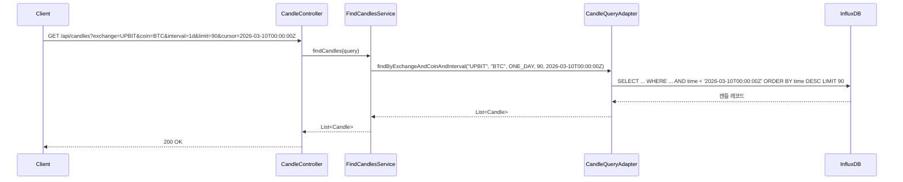

# 개요

캔들(OHLC) 차트 데이터를 조회하는 REST API다.
InfluxDB에 저장된 시계열 캔들 데이터를 커서 기반 페이징으로 반환한다.

InfluxDB 저장 구조는 [candle-data.md](../candle-data.md)를 참고한다.

# 목적

- 거래소별, 코인별 캔들 차트를 프론트엔드에 제공한다
- 6개 주기(1분, 1시간, 4시간, 일, 주, 월)를 지원한다
- 커서 기반 페이징으로 과거 캔들을 스크롤할 수 있다

## 사용처

- **마켓 탭**: CandleChartPanel에서 거래소/코인 선택 시 캔들 차트를 렌더링한다
- 프론트엔드는 `GET /api/candles`를 호출하고, 응답의 `data` 배열에서 OHLC + timestamp를 추출하여 SVG 캔들 차트를 그린다

# InfluxDB 조회 구조

measurement는 주기별로 분리되어 있다 (`candle_1m`, `candle_1h`, `candle_4h`, `candle_1d`, `candle_1w`, `candle_1M`).
interval 파라미터를 measurement 이름으로 매핑하여 쿼리한다.

| interval | measurement |
|----------|-------------|
| `1m` | `candle_1m` |
| `1h` | `candle_1h` |
| `4h` | `candle_4h` |
| `1d` | `candle_1d` |
| `1w` | `candle_1w` |
| `1M` | `candle_1M` |

### 쿼리 예시

```sql
-- 최근 90개 일봉
SELECT open, high, low, close
FROM candle_1d
WHERE exchange = 'UPBIT' AND coin = 'BTC'
ORDER BY time DESC
LIMIT 90

-- 커서 기반 과거 스크롤
SELECT open, high, low, close
FROM candle_1d
WHERE exchange = 'UPBIT' AND coin = 'BTC' AND time < '2026-03-10T00:00:00Z'
ORDER BY time DESC
LIMIT 90
```

# 검증

| 항목 | 규칙 | 실패 시 에러 |
|------|------|-------------|
| interval | `1m`, `1h`, `4h`, `1d`, `1w`, `1M` 중 하나 | `INVALID_CANDLE_INTERVAL` |
| limit | 1 이상 200 이하 | `INVALID_CANDLE_LIMIT` |

# 크로스 컨텍스트 의존

없음 (marketdata 컨텍스트 단독. InfluxDB 직접 조회)

# API 명세

`GET /api/candles?exchange={exchange}&coin={coin}&interval={interval}&limit={limit}&cursor={cursor}`

## Query Parameters

| 필드 | 타입 | 필수 | 기본값 | 설명 |
|------|------|------|--------|------|
| exchange | String | O | | 거래소 코드 (`UPBIT`, `BITHUMB`, `BINANCE`) |
| coin | String | O | | 코인 심볼 (`BTC`, `ETH` 등) |
| interval | String | O | | 캔들 주기 (`1m`, `1h`, `4h`, `1d`, `1w`, `1M`) |
| limit | Integer | X | 60 | 조회할 캔들 개수 (1~200) |
| cursor | String | X | | ISO 8601 타임스탬프. 이 시각 이전의 캔들을 조회한다 (과거 스크롤용) |

## Response

```json
{
  "status": 200,
  "code": "SUCCESS",
  "message": "캔들 데이터를 조회했습니다.",
  "data": [
    {
      "time": "2026-03-10T00:00:00Z",
      "open": 68500000.0,
      "high": 69200000.0,
      "low": 67800000.0,
      "close": 68900000.0
    },
    {
      "time": "2026-03-11T00:00:00Z",
      "open": 68900000.0,
      "high": 70100000.0,
      "low": 68400000.0,
      "close": 69750000.0
    }
  ]
}
```

### 응답 필드

| 필드 | 타입 | 설명 |
|------|------|------|
| time | String | 캔들 시작 시각 (ISO 8601) |
| open | Double | 시가 |
| high | Double | 고가 |
| low | Double | 저가 |
| close | Double | 종가 |

### 정렬

- 시간 오름차순(oldest first)으로 반환한다
- InfluxDB에서 `ORDER BY time DESC`로 조회한 뒤 역순 정렬하여 응답한다

### 빈 결과

- 해당 조건의 캔들이 없으면 빈 배열을 반환한다 (200 OK, `data: []`)

## 에러 응답

| code | status | 설명 |
|------|--------|------|
| INVALID_CANDLE_INTERVAL | 400 | 지원하지 않는 캔들 주기 |
| INVALID_CANDLE_LIMIT | 400 | limit 범위 초과 (1~200) |

# 포트/어댑터

## 레이어 구조

| 레이어 | 클래스 | 설명 |
|--------|--------|------|
| Controller | `CandleController` | 요청 파라미터 검증 및 Query 변환 |
| UseCase | `FindCandlesUseCase` | 캔들 조회 유스케이스 인터페이스 |
| Service | `FindCandlesService` | 오케스트레이션 (Output Port 호출) |
| Output Port | `CandleQueryPort` | InfluxDB 캔들 조회 포트 인터페이스 |
| Adapter | `CandleQueryAdapter` | InfluxDB 클라이언트로 직접 쿼리 |

## DTO 흐름

```
FindCandlesRequest → FindCandlesQuery → [Service] → List<Candle> → CandleResponse
  (adapter/in)        (port/in/dto/query)   (domain)       (adapter/in)
```

## 도메인 모델

- `Candle`: time(Instant), open(double), high(double), low(double), close(double)
- `CandleInterval`: enum (`ONE_MINUTE`, `ONE_HOUR`, `FOUR_HOURS`, `ONE_DAY`, `ONE_WEEK`, `ONE_MONTH`)
  - `measurement()` 메서드로 InfluxDB measurement 이름을 반환한다 (예: `ONE_DAY` → `"candle_1d"`)
  - `of(String)` 팩토리 메서드로 문자열(`"1d"`)을 enum으로 변환한다

## Output Port

```java
public interface CandleQueryPort {
    List<Candle> findByExchangeAndCoinAndInterval(
        String exchange, String coin, CandleInterval interval, int limit, Instant cursor);
}
```

- cursor가 null이면 최신 캔들부터, 값이 있으면 해당 시각 이전 캔들을 조회한다
- 시간 오름차순으로 정렬하여 반환한다

## Adapter

- `CandleQueryAdapter`는 InfluxDB Java 클라이언트를 사용하여 쿼리한다
- JPA/MySQL을 사용하지 않는다
- `adapter/out/` 패키지에 위치한다

# 시퀀스 다이어그램

```mermaid
sequenceDiagram
    participant Client
    participant Controller as CandleController
    participant Service as FindCandlesService
    participant Port as CandleQueryPort
    participant Adapter as CandleQueryAdapter
    participant InfluxDB

    Client->>Controller: GET /api/candles?exchange=UPBIT&coin=BTC&interval=1d&limit=90
    Controller->>Controller: FindCandlesRequest 검증 및 FindCandlesQuery 변환

    Controller->>Service: findCandles(query)

    rect rgb(60, 60, 60)
        Note over Service,InfluxDB: STEP 01 InfluxDB 캔들 조회
    end
    Service->>Port: findByExchangeAndCoinAndInterval("UPBIT", "BTC", ONE_DAY, 90, null)
    Port->>Adapter: InfluxDB 쿼리 실행
    Adapter->>InfluxDB: SELECT open, high, low, close FROM candle_1d WHERE exchange='UPBIT' AND coin='BTC' ORDER BY time DESC LIMIT 90
    InfluxDB-->>Adapter: 캔들 레코드
    Adapter-->>Port: List<Candle> (시간 오름차순)
    Port-->>Service: List<Candle>

    Service-->>Controller: List<Candle>
    Controller->>Controller: List<Candle> → List<CandleResponse> 변환
    Controller-->>Client: 200 OK (ApiResponseDto)
```



### 커서 기반 과거 스크롤


