# 개요

특정 거래소의 특정 코인이 지원하는 체인(네트워크) 목록을 조회하는 REST API다.
정적 데이터이므로 프론트엔드가 첫 조회 후 캐싱하여 재사용한다.

# 목적

- 출금 화면에서 네트워크 선택 드롭다운에 사용 가능한 체인 목록을 제공한다
- 체인별 태그(메모) 입력 필요 여부를 함께 전달하여 UI 분기에 활용한다

## 사용처

- **출금 화면**: 코인과 거래소를 선택하면 사용 가능한 네트워크 목록을 드롭다운에 표시한다. 현재 mock(`mocks/wallet.ts`)의 `coinChains`와 `tagRequiredCoins`로 하드코딩된 데이터를 대체한다
- **입금 화면**: 네트워크 선택 후 입금 주소를 조회할 때, 선택 가능한 네트워크 목록을 먼저 표시한다

# 크로스 컨텍스트 의존

없음 (marketdata 컨텍스트 단독. ExchangeCoin, ExchangeCoinChain 모두 같은 컨텍스트)

# API 명세

`GET /api/exchanges/{exchangeId}/coins/{coinId}/chains`

## Path Parameters

| 필드 | 타입 | 필수 | 설명 |
|------|------|------|------|
| exchangeId | Long | O | 거래소 ID |
| coinId | Long | O | 코인 ID |

## Response

```json
{
  "status": 200,
  "code": "SUCCESS",
  "message": "코인 체인 목록을 조회했습니다.",
  "data": [
    {
      "exchangeCoinChainId": 1,
      "chain": "Bitcoin",
      "tagRequired": false
    },
    {
      "exchangeCoinChainId": 2,
      "chain": "ERC-20",
      "tagRequired": false
    },
    {
      "exchangeCoinChainId": 3,
      "chain": "BEP-20",
      "tagRequired": false
    }
  ]
}
```

## 에러 응답

| code | status | 설명 |
|------|--------|------|
| EXCHANGE_COIN_NOT_FOUND | 404 | 해당 거래소에 상장되지 않은 코인 |

# 포트/어댑터

## UseCase (Input Port)

- `FindCoinChainsUseCase`: `List<ExchangeCoinChain> findByExchangeIdAndCoinId(Long exchangeId, Long coinId)`
- 단일 Aggregate(ExchangeCoinChain) 목록 조회이므로 도메인 모델을 직접 반환한다

## QueryPort (Output Port)

- `ExchangeCoinChainQueryPort`에 메서드 추가: `List<ExchangeCoinChain> findByExchangeIdAndCoinId(Long exchangeId, Long coinId)`
- 기존 `findByExchangeIdAndCoinIdAndChain`은 크로스 컨텍스트 단건 조회용으로 유지한다

## Adapter

- `ExchangeCoinChainQueryAdapter`에 QueryDSL 구현 추가
- ExchangeCoinChain과 ExchangeCoin을 조인하여 exchangeId + coinId 조건으로 조회한다

# 시퀀스 다이어그램

```mermaid
sequenceDiagram
    participant Client
    participant Controller as ExchangeCoinChainController
    participant Service as FindCoinChainsService
    participant Port as ExchangeCoinChainQueryPort
    participant Adapter as ExchangeCoinChainQueryAdapter
    participant MySQL

    Client->>Controller: GET /api/exchanges/{exchangeId}/coins/{coinId}/chains
    Controller->>Service: findByExchangeIdAndCoinId(exchangeId, coinId)

    rect rgb(60, 60, 60)
        Note over Service,MySQL: STEP 01 해당 거래소/코인의 체인 목록 조회
    end
    Service->>Port: findByExchangeIdAndCoinId(exchangeId, coinId)
    Port->>Adapter: QueryDSL JOIN exchange_coin_chain + exchange_coin
    Adapter->>MySQL: SELECT ecc.* FROM exchange_coin_chain ecc JOIN exchange_coin ec ON ecc.exchange_coin_id = ec.exchange_coin_id WHERE ec.exchange_id = ? AND ec.coin_id = ?
    Adapter-->>Port: List<ExchangeCoinChain>
    Port-->>Service: List<ExchangeCoinChain>

    Service-->>Controller: List<ExchangeCoinChain>
    Controller-->>Client: 200 OK (ApiResponseDto)
```


