# 개요

거래소 ID로 해당 거래소에 상장된 코인 전체 목록을 조회하는 REST API다.
정적 데이터이므로 프론트엔드가 캐싱하여 재사용한다.

# 목적

- 거래소별 상장 코인 목록(exchangeCoinId, coinId, symbol, name)을 제공한다
- 정적 참조 데이터로, 여러 화면에서 캐싱하여 공유한다

## 사용처

- **마켓 탭**: CoinTable에서 거래소별 전체 코인 시세 목록을 렌더링한다. 현재 mock(`mocks/coins.ts`)으로 하드코딩된 데이터를 대체한다
- **주문 화면**: OrderPanel에서 coinSymbol → exchangeCoinId 매핑에 사용한다. 현재 하드코딩된 `id-mapping.ts`의 ORDER_ID_MAP을 동적으로 대체한다
- **입출금 탭**: WalletAssetTable에서 거래소 전체 코인을 표시하고, 잔고 API 응답과 coinId로 매핑하여 보유 여부를 판별한다


# 크로스 컨텍스트 의존

없음 (marketdata 컨텍스트 단독. Coin 테이블도 같은 컨텍스트)

# API 명세

`GET /api/exchanges/{exchangeId}/coins`

### Path Parameters

| 필드 | 타입 | 필수 | 설명 |
|------|------|------|------|
| exchangeId | Long | O | 거래소 ID |

### Response

```json
{
  "status": 200,
  "code": "SUCCESS",
  "message": "거래소 상장 코인 목록을 조회했습니다.",
  "data": [
    {
      "exchangeCoinId": 101,
      "coinId": 1,
      "coinSymbol": "BTC",
      "coinName": "비트코인"
    },
    {
      "exchangeCoinId": 102,
      "coinId": 2,
      "coinSymbol": "ETH",
      "coinName": "이더리움"
    }
  ]
}
```

### 에러 응답

| code | status | 설명 |
|------|--------|------|
| EXCHANGE_NOT_FOUND | 404 | 거래소를 찾을 수 없음 |

# 시퀀스 다이어그램

```mermaid
sequenceDiagram
    participant Client
    participant Controller as ExchangeCoinController
    participant Service as FindExchangeCoinsService
    participant CoinPort as ExchangeCoinQueryPort
    participant CoinInfoPort as CoinQueryPort
    participant MySQL

    Client->>Controller: GET /api/exchanges/{exchangeId}/coins
    Controller->>Service: findByExchangeId(exchangeId)

    rect rgb(60, 60, 60)
        Note over Service,MySQL: STEP 01 거래소 상장 코인 목록 조회
    end
    Service->>CoinPort: findByExchangeId(exchangeId)
    CoinPort->>MySQL: SELECT exchange_coin WHERE exchange_id = ?
    CoinPort-->>Service: List<ExchangeCoinInfo> (exchangeCoinId, coinId)

    rect rgb(60, 60, 60)
        Note over Service,MySQL: STEP 02 코인 심볼/이름 조회
    end
    Service->>CoinInfoPort: findInfoByIds(coinIds)
    CoinInfoPort->>MySQL: SELECT coin WHERE id IN (...)
    CoinInfoPort-->>Service: Map<Long, CoinInfo> (symbol, name)

    Note over Service: 조합: exchangeCoinId + coinId + symbol + name
    Service-->>Controller: List<ExchangeCoinListResult>
    Controller-->>Client: 200 OK
```


