# 개요

백엔드 기동 시 Redis의 market-meta 데이터와 application.yml 거래소 설정을 읽어
coin, exchange_market, exchange_coin 테이블을 자동으로 초기화한다.
H2 인메모리 DB이므로 매 기동 시 빈 테이블에 INSERT한다.

# 배경

- 시세 수집기(별도 서비스)가 거래소 API에서 마켓 목록을 수집하여 Redis에 저장한다
- 현재 coin, exchange_coin, exchange_market 데이터를 수동으로 넣어야 하는 상태
- 수수료율/기축통화 등 비즈니스 설정은 거래소 API에서 가져올 수 없다

# Redis 저장 구조 (시세 수집기가 관리)

```
키: market-meta:UPBIT
값: [{"base":"BTC","quote":"KRW","displayName":"비트코인"}, ...]

키: market-meta:BITHUMB
값: [{"base":"BTC","quote":"KRW","displayName":"비트코인"}, ...]

키: market-meta:BINANCE
값: [{"base":"BTC","quote":"USDT","displayName":"BTC"}, ...]
```

# application.yml 거래소 설정

```yaml
app:
  exchanges:
    - name: UPBIT
      market-type: DOMESTIC
      base-currency-symbol: KRW
      fee-rate: 0.0005
    - name: BITHUMB
      market-type: DOMESTIC
      base-currency-symbol: KRW
      fee-rate: 0.0025
    - name: BINANCE
      market-type: OVERSEAS
      base-currency-symbol: USDT
      fee-rate: 0.001
```

# 크로스 컨텍스트 의존

없음 (marketdata 컨텍스트 단독)

# 처리 흐름

```mermaid
sequenceDiagram
    participant App as MarketdataWarmupInitializer
    participant Service as SyncMarketMetaService
    participant Redis
    participant MySQL as H2 DB
    participant Warmup as WarmupExchangeCoinMappingService
    participant Listener as RabbitMQ Listener

    App->>Service: syncMarketMeta()

    rect rgb(60, 60, 60)
        Note over Service,Redis: STEP 01 Redis에서 market-meta 조회
    end
    Service->>Redis: GET market-meta:UPBIT, market-meta:BITHUMB, market-meta:BINANCE
    Redis-->>Service: JSON 배열 (base, quote, displayName)

    rect rgb(60, 60, 60)
        Note over Service,MySQL: STEP 02 coin 테이블 INSERT
    end
    Note over Service: 모든 거래소의 base + quote 심볼 수집 (중복 제거)
    Note over Service: displayName은 국내거래소(한국어명) 우선
    Service->>MySQL: INSERT coin (symbol, name) × N건

    rect rgb(60, 60, 60)
        Note over Service,MySQL: STEP 03 exchange_market 테이블 INSERT
    end
    Note over Service: yml 설정의 base-currency-symbol → coin_id resolve
    Service->>MySQL: INSERT exchange_market (name, market_type, base_currency_coin_id, fee_rate) × 3건

    rect rgb(60, 60, 60)
        Note over Service,MySQL: STEP 04 exchange_coin 테이블 INSERT
    end
    Note over Service: 거래소별 Redis 데이터의 base 심볼 → coin_id + exchange_id 매핑
    Service->>MySQL: INSERT exchange_coin (exchange_id, coin_id) × M건

    App->>Warmup: warmup()
    App->>Listener: start()
```



# 구현 범위

## 변경

- **CoinJpaEntity**: `@Immutable` 제거, `@GeneratedValue(IDENTITY)` 추가, 생성자 추가
- **ExchangeCoinJpaEntity**: `@Immutable` 제거, `@GeneratedValue(IDENTITY)` 추가, 생성자 추가
- **ExchangeJpaEntity**: `@GeneratedValue(IDENTITY)` 추가
- **CoinJpaRepository**: `findBySymbol` 메서드 추가
- **ExchangeJpaRepository**: `findByName` 메서드 추가
- **MarketdataWarmupInitializer**: syncMarketMeta 호출을 warmup 앞에 추가
- **application.yml**: `app.exchanges` 설정 추가

## 신규

- **ExchangeProperties**: `@ConfigurationProperties("app")` — 거래소 설정 바인딩
- **MarketMetaQueryPort**: Redis에서 market-meta를 읽는 Output Port
- **MarketMetaQueryAdapter**: MarketMetaQueryPort 구현 (StringRedisTemplate 사용)
- **CoinCommandPort**: coin INSERT용 Output Port
- **CoinJpaPersistenceAdapter**: CoinCommandPort 구현
- **ExchangeCommandPort**: exchange_market INSERT용 Output Port
- **ExchangeJpaPersistenceAdapter**: ExchangeCommandPort 구현
- **ExchangeCoinCommandPort**: exchange_coin INSERT용 Output Port
- **ExchangeCoinJpaPersistenceAdapter**: ExchangeCoinCommandPort 구현
- **SyncMarketMetaUseCase**: Input Port
- **SyncMarketMetaService**: 위 흐름을 조율하는 서비스

# displayName 우선순위

동일 심볼이 여러 거래소에 있을 때 코인명(displayName) 결정 규칙:
1. 국내 거래소(UPBIT, BITHUMB)의 displayName 우선 (한국어명)
2. 국내 거래소가 없으면 해외 거래소의 displayName 사용
3. quote 심볼(KRW, USDT)의 name은 심볼 그대로 사용
