# 개요

로그인 유저 본인의 랭킹 순위를 조회한다.

# 선행 사항

> 수익률 계산, 참여 자격, 동률 처리, 배치 집계, RANKING 테이블 스키마는 [business-rules.md](./business-rules.md)를 참조한다.

# 입력 정보

- 기간(`period`): 일간/주간/월간 중 선택
- 유저 ID(`userId`): Request Parameter로 전달

# 검증

## 기간 검증

| 항목 | 규칙 |
|------|------|
| period | `DAILY`, `WEEKLY`, `MONTHLY` 중 하나여야 한다 |
| 유효하지 않은 값 | `INVALID_RANKING_PERIOD` 에러 반환 |

# 처리 로직

1. Request Parameter에서 `userId`를 받는다
2. RANKING 테이블에서 `userId` + `period` + 최신 `referenceDate`로 조회한다
3. 랭킹 데이터가 있으면 순위, 닉네임, 수익률, 거래 횟수를 반환한다
4. 미참여(데이터 없음) 시 `data: null`을 반환한다 (에러가 아님)

## 설계 포인트

- 인증 미구현 상태이므로 `userId`를 Request Parameter로 받는다 (인증 구현 후 SecurityContext로 전환)
- `referenceDate`는 내부적으로 최신 날짜를 자동 결정한다 (클라이언트 파라미터 불필요)
- 미참여 시 200 OK + `data: null` — 에러 응답이 아닌 정상 응답으로 처리한다

# API 명세

`GET /api/rankings/me`

## Request Parameters (Query String)

| 필드 | 타입 | 필수 | 설명 |
|------|------|------|------|
| userId | Long | O | 유저 ID (인증 구현 전 임시) |
| period | String | O | `DAILY` \| `WEEKLY` \| `MONTHLY` |

## Request

```
GET /api/rankings/me?userId=1&period=DAILY
```

## Response (랭킹 참여 중)

```json
{
  "status": 200,
  "code": "SUCCESS",
  "message": "내 랭킹을 조회했습니다.",
  "data": {
    "rank": 26,
    "nickname": "포지션마스터",
    "profitRate": 27.95,
    "tradeCount": 77
  }
}
```

## Response (랭킹 미참여)

```json
{
  "status": 200,
  "code": "SUCCESS",
  "message": "내 랭킹을 조회했습니다.",
  "data": null
}
```

## 에러 응답

| code | status | 설명 |
|------|--------|------|
| INVALID_RANKING_PERIOD | 400 | 유효하지 않은 기간 값 |

# 시퀀스 다이어그램

```mermaid
sequenceDiagram
    participant Client
    participant Controller as RankingController
    participant Service as GetMyRankingService
    participant RankingAdapter as RankingPersistenceAdapter
    participant MySQL

    Client->>Controller: GET /api/rankings/me?userId=1&period=DAILY
    Note over Controller: Request Parameter에서 userId 추출
    Controller->>Service: getMyRanking(query)

    rect rgb(60, 60, 60)
        Note over Service,MySQL: STEP 01 최신 기준 날짜 결정
    end
    Service->>RankingAdapter: findLatestReferenceDate(period)
    RankingAdapter->>MySQL: SELECT MAX(reference_date) WHERE period = ?
    RankingAdapter-->>Service: latestDate

    rect rgb(60, 60, 60)
        Note over Service,MySQL: STEP 02 내 랭킹 조회
    end
    Service->>RankingAdapter: findByUserIdAndPeriodAndReferenceDate(userId, period, latestDate)
    RankingAdapter->>MySQL: SELECT ranking JOIN user WHERE user_id = ? AND period = ? AND reference_date = ?
    RankingAdapter-->>Service: Optional<MyRankingResult>

    alt 랭킹 데이터 있음
        Service-->>Controller: MyRankingResult
        Controller-->>Client: 200 OK (data: { rank, nickname, ... })
    else 랭킹 미참여
        Service-->>Controller: null
        Controller-->>Client: 200 OK (data: null)
    end
```


