# 개요

랭킹 상위 100위 유저의 포트폴리오를 열람한다. 보유 코인 비율만 공개하고 수량은 비공개이다.

# 선행 사항

> 수익률 계산, 참여 자격, 동률 처리, 배치 집계, RANKING 테이블, 포트폴리오 스냅샷, 포트폴리오 열람 규칙은 [business-rules.md](./business-rules.md)를 참조한다.

# 입력 정보

- 대상 유저 ID(`userId`): 포트폴리오를 열람할 유저
- 기간(`period`): 해당 유저가 랭킹에 포함된 기간

# 검증

## 열람 가능 조건

| 항목 | 규칙 | 실패 시 에러 |
|------|------|-------------|
| 순위 | 해당 기간 최신 랭킹에서 100위 이내 | `PORTFOLIO_VIEW_NOT_ALLOWED` |
| 공개 설정 | 대상 유저의 `portfolio_public = true` | `PORTFOLIO_PRIVATE` |
| 라운드 상태 | 진행 중인 라운드의 포트폴리오만 열람 가능 | `ROUND_NOT_ACTIVE` |

# 처리 로직

1. 대상 유저의 최신 랭킹 순위를 확인한다 (해당 period, 최신 referenceDate)
2. 순위가 100위 이내인지 검증한다
3. 대상 유저의 `portfolio_public` 설정을 확인한다
4. `PORTFOLIO_SNAPSHOT_DETAIL` 테이블에서 해당 유저의 최신 스냅샷을 조회한다
5. 코인별 `asset_ratio`(자산 비율)를 반환한다. `quantity`(수량)는 비공개로 응답에 포함하지 않는다

## 공개 정보 vs 비공개 정보

| 정보 | 공개 여부 |
|------|-----------|
| 보유 코인 목록 | 공개 |
| 코인별 자산 비율 (%) | 공개 |
| 코인별 수익률 (%) | 공개 |
| 평균 매수가 | 비공개 |
| 보유 수량 | 비공개 |
| 총 자산 금액 | 비공개 |

# API 명세

## 참고사항

- 랭킹 화면에서 특정 유저를 클릭하여 진입하는 흐름이다
- 비공개 유저는 랭킹에는 노출되지만 포트폴리오 열람 시 `PORTFOLIO_PRIVATE` 에러를 반환한다

`GET /api/rankings/{userId}/portfolio`

## Path Parameters

| 필드 | 타입 | 필수 | 설명 |
|------|------|------|------|
| userId | Long | O | 열람 대상 유저 ID |

## Request Parameters (Query String)

| 필드 | 타입 | 필수 | 설명 |
|------|------|------|------|
| period | String | O | `DAILY` \| `WEEKLY` \| `MONTHLY` |

## Request

```
GET /api/rankings/42/portfolio?period=DAILY
```

## Response

```json
{
  "status": 200,
  "code": "SUCCESS",
  "message": "포트폴리오를 조회했습니다.",
  "data": {
    "userId": 42,
    "nickname": "코인마스터",
    "rank": 1,
    "profitRate": 15.23,
    "holdings": [
      {
        "coinSymbol": "BTC",
        "exchangeName": "업비트",
        "assetRatio": 45.2,
        "profitRate": 12.5
      },
      {
        "coinSymbol": "ETH",
        "exchangeName": "바이낸스",
        "assetRatio": 30.1,
        "profitRate": 8.3
      },
      {
        "coinSymbol": "KRW",
        "exchangeName": "업비트",
        "assetRatio": 24.7,
        "profitRate": 0.0
      }
    ]
  }
}
```

## 에러 응답

| code | status | 설명 |
|------|--------|------|
| INVALID_RANKING_PERIOD | 400 | 유효하지 않은 기간 값 |
| USER_NOT_FOUND | 404 | 유저를 찾을 수 없음 |
| PORTFOLIO_VIEW_NOT_ALLOWED | 403 | 100위 이내가 아닌 유저의 포트폴리오 열람 시도 |
| PORTFOLIO_PRIVATE | 403 | 포트폴리오 비공개 유저 |
| ROUND_NOT_ACTIVE | 404 | 진행 중인 라운드가 없음 |

# 시퀀스 다이어그램

```mermaid
sequenceDiagram
    participant Client
    participant Controller as RankingController
    participant Service as GetRankerPortfolioService
    participant RankingAdapter as RankingPersistenceAdapter
    participant UserAdapter as UserQueryAdapter
    participant SnapshotAdapter as PortfolioSnapshotAdapter
    participant MySQL

    Client->>Controller: GET /api/rankings/42/portfolio?period=DAILY
    Controller->>Service: getRankerPortfolio(query)

    rect rgb(60, 60, 60)
        Note over Service,MySQL: STEP 01 랭킹 순위 확인
    end
    Service->>RankingAdapter: findByUserIdAndPeriod(userId, period, latestDate)
    RankingAdapter->>MySQL: SELECT ranking WHERE user_id AND period
    RankingAdapter-->>Service: ranking
    Note over Service: 순위 100위 이내 검증

    rect rgb(60, 60, 60)
        Note over Service,MySQL: STEP 02 유저 공개 설정 확인
    end
    Service->>UserAdapter: getUserById(userId)
    UserAdapter->>MySQL: SELECT user
    UserAdapter-->>Service: user
    Note over Service: portfolio_public = true 검증

    rect rgb(60, 60, 60)
        Note over Service,MySQL: STEP 03 포트폴리오 스냅샷 조회
    end
    Service->>SnapshotAdapter: findLatestSnapshotDetails(userId, roundId)
    SnapshotAdapter->>MySQL: SELECT snapshot_detail JOIN coin JOIN exchange
    SnapshotAdapter-->>Service: snapshotDetails

    Service-->>Controller: RankerPortfolioResult
    Controller-->>Client: 200 OK
```


