# 개요

기간별 랭킹 통계(참여자 수, 최고 수익률, 평균 수익률)를 조회한다.

# 선행 사항

> 수익률 계산, 배치 집계, RANKING 테이블 스키마는 [business-rules.md](./business-rules.md)를 참조한다.

# 입력 정보

- 기간(`period`): 일간/주간/월간 중 선택

# 검증

## 기간 검증

| 항목 | 규칙 |
|------|------|
| period | `DAILY`, `WEEKLY`, `MONTHLY` 중 하나여야 한다 |
| 유효하지 않은 값 | `INVALID_RANKING_PERIOD` 에러 반환 |

# 처리 로직

1. RANKING 테이블에서 `period` + 최신 `referenceDate` 기준으로 집계한다
2. 참여자 수, 최고 수익률, 평균 수익률을 계산한다
3. 해당 기간의 랭킹 데이터가 없으면 `RANKING_NOT_FOUND` 에러를 반환한다

## 설계 포인트

- 인증 불필요 (공개 통계)
- 상위 100명 데이터이므로 실시간 집계도 부담 없음
- `referenceDate`는 내부적으로 최신 날짜를 자동 결정한다

## 집계 쿼리

```sql
SELECT COUNT(*), MAX(profit_rate), AVG(profit_rate)
FROM ranking
WHERE period = :period
  AND reference_date = :referenceDate
```

# API 명세

`GET /api/rankings/stats`

## Request Parameters (Query String)

| 필드 | 타입 | 필수 | 설명 |
|------|------|------|------|
| period | String | O | `DAILY` \| `WEEKLY` \| `MONTHLY` |

## Request

```
GET /api/rankings/stats?period=DAILY
```

## Response

```json
{
  "status": 200,
  "code": "SUCCESS",
  "message": "랭킹 통계를 조회했습니다.",
  "data": {
    "totalParticipants": 100,
    "maxProfitRate": 45.52,
    "avgProfitRate": 7.31
  }
}
```

## 에러 응답

| code | status | 설명 |
|------|--------|------|
| INVALID_RANKING_PERIOD | 400 | 유효하지 않은 기간 값 |
| RANKING_NOT_FOUND | 404 | 해당 기간의 랭킹 데이터가 없음 |

# 시퀀스 다이어그램

```mermaid
sequenceDiagram
    participant Client
    participant Controller as RankingController
    participant Service as GetRankingStatsService
    participant RankingAdapter as RankingPersistenceAdapter
    participant MySQL

    Client->>Controller: GET /api/rankings/stats?period=DAILY
    Controller->>Service: getRankingStats(query)

    rect rgb(60, 60, 60)
        Note over Service,MySQL: STEP 01 최신 기준 날짜 결정
    end
    Service->>RankingAdapter: findLatestReferenceDate(period)
    RankingAdapter->>MySQL: SELECT MAX(reference_date) WHERE period = ?
    RankingAdapter-->>Service: latestDate

    alt 랭킹 데이터 없음
        Service-->>Controller: RANKING_NOT_FOUND 에러
        Controller-->>Client: 404 Not Found
    end

    rect rgb(60, 60, 60)
        Note over Service,MySQL: STEP 02 통계 집계
    end
    Service->>RankingAdapter: getRankingStats(period, latestDate)
    RankingAdapter->>MySQL: SELECT COUNT(*), MAX(profit_rate), AVG(profit_rate)
    RankingAdapter-->>Service: RankingStatsResult

    Service-->>Controller: RankingStatsResult
    Controller-->>Client: 200 OK
```


