# 개요

투자 라운드의 복기 리포트를 조회한다. 거래소별 투자 원칙 위반 분석, 규칙별 시나리오 시뮬레이션, 위반 거래 목록을 제공한다.

# 목적

- 사용자가 설정한 투자 원칙을 얼마나 지켰는지, 위반이 자산에 어떤 영향을 미쳤는지 정량적으로 분석한다
- "원칙을 지켰다면?" 시뮬레이션을 통해 규칙별 수익률 영향(impactGap)을 보여준다
- 놓친 수익 금액(missedProfit)으로 원칙 준수의 가치를 체감하게 한다
- 위반 거래별로 어떤 규칙을 위반했는지, 결과적으로 이익/손실이었는지 보여준다

# 선행 구현 사항

## 포트폴리오 스냅샷

일별 자산 추이를 분석하기 위해 `PORTFOLIO_SNAPSHOT`이 배치로 적재되어 있어야 한다.

스냅샷 배치 상세는 [portfolio-snapshot-batch.md](../batch/portfolio-snapshot-batch.md)를 참조한다.

## 투자 원칙 위반 기록

주문 시점에 `RULE_VIOLATION` 테이블에 위반 기록이 저장되어 있어야 한다.

- 위반 기록에는 `order_id` (nullable), `rule_id`가 포함된다
- cex-order.md에 정의된 3가지 주문 시점 체크(추격 매수 금지, 물타기 제한, 과매매 제한)와 2가지 가격 모니터링(손절, 익절) 위반이 기록된다
- 하나의 주문이 여러 규칙을 동시에 위반할 수 있다 (예: 추격 매수 금지 + 물타기 제한 동시 위반)

## 주문 체결 이력

`ORDERS` 테이블에서 해당 라운드의 전체 주문 체결 이력을 조회할 수 있어야 한다.

- 라운드 → 지갑(Wallet) → 주문(Orders) 경로로 라운드의 전체 주문을 조회한다
- 체결 완료된 주문만 분석 대상이다 (status = FILLED)

# 복기 리포트 조회

## 구성 요소

요청한 거래소의 다음 데이터를 제공한다. 거래소마다 기축통화가 다르므로(국내: KRW, 바이낸스: USDT) 거래소별로 요청한다.

1. **요약 지표**: 놓친 수익, 실제 수익률, 원칙 준수 시 수익률, 총 위반 횟수
2. **규칙별 시나리오 (Rule Impact)**: 각 원칙을 지켰다면 달라졌을 수익률 시뮬레이션
3. **위반 거래 목록 (Violation Detail)**: 원칙을 위반한 개별 거래와 위반 규칙, 손익

## 조회 조건

- `roundId`로 해당 투자 라운드의 복기 리포트를 조회한다
- 라운드 소유자만 조회할 수 있다 (본인 라운드 검증)
- 라운드 상태는 ACTIVE 또는 ENDED 모두 조회 가능하다

## 처리 로직

### 리포트 생성

배치(RegretReportJob)에서 리포트를 사전 생성한다. API는 배치가 생성한 데이터를 조회만 한다. 리포트가 아직 없으면 (라운드 시작 당일 등) `REPORT_NOT_FOUND` 에러를 반환한다.

배치 상세는 [portfolio-snapshot-batch.md](../batch/portfolio-snapshot-batch.md)를 참조한다.

### 손실 계산

원칙별 손실 금액 계산과 기준가 결정 로직은 [business-rules.md](business-rules.md)를 참조한다.

**위반분 우선 매칭 (매수 위반 규칙):**

`CHASE_BUY_BAN`, `AVERAGING_DOWN_LIMIT`, `OVERTRADING_LIMIT`(매수)의 경우, 위반 매수분이 먼저 매도된 것으로 간주하여 기준가를 결정한다. 이를 위해 위반 주문뿐 아니라 **해당 코인의 이후 매도 이력**도 함께 조회한다. 상세 로직은 [business-rules.md의 기준가 결정 로직](business-rules.md#기준가-결정-로직)을 참조한다.

### 시나리오 생성

거래소별로 시나리오를 생성한다.

1. 해당 거래소에서 해당 원칙의 모든 위반 거래의 `loss_amount`를 합산하여 `totalLossAmount`를 산출한다
2. 원칙 준수 시 총 자산 = 실제 총 자산 + totalLossAmount
3. 원칙 준수 시 수익률 = (원칙 준수 시 총 자산 - 총 투입금) / 총 투입금 × 100
4. `impactGap` = 원칙 준수 시 수익률 - 실제 수익률 (%p)
5. 시나리오 설명은 클라이언트에서 `impactGap` 부호를 보고 직접 렌더링한다

**실제 총 자산 기준:** 배치가 적재한 마지막 `PORTFOLIO_SNAPSHOT`의 총 자산을 사용한다.

### 놓친 수익 계산

규칙을 지켰다면 얼마나 더 벌 수 있었는지를 거래소별로 각각 산출한다. 거래소마다 기축통화가 다르므로(국내: KRW, 바이낸스: USDT) 합산하지 않고 따로 보여준다. 환율 변동이 손익에 섞이는 것을 방지하기 위함이다.

```
missedProfit = max(0, Σ all loss_amounts)
```

- 해당 거래소의 모든 위반 거래 `loss_amount`를 합산한다
- 합산 결과가 음수면 0으로 처리한다 (원칙을 지켰어도 손해인 경우 "놓친 수익 없음")

### 갱신 정책

- **ACTIVE 라운드**: 배치(RegretReportJob)가 매일 갱신한다. API는 배치 결과를 조회만 한다. 미실현분은 배치 시점의 현재가로 계산되어 있으며, 다음 배치까지 변하지 않는다
- **ENDED 라운드**: 종료 시 1회 확정 생성 후 변하지 않는다. 실현분은 매도 체결가로 고정된다
- **리포트 미존재 시** (라운드 시작 당일 등): `REPORT_NOT_FOUND` 에러를 반환한다. 배치 실행 후 조회 가능하다

### 규칙 기준값 단위 (`thresholdUnit`)

규칙 유형에 따라 기준값의 단위가 결정된다.

| 규칙 유형 | thresholdUnit | 예시 |
|-----------|---------------|------|
| `LOSS_CUT` | `%` | 10% 하락 시 손절 |
| `PROFIT_TAKE` | `%` | 30% 상승 시 익절 |
| `CHASE_BUY_BAN` | `%` | 20% 이상 급등 시 매수 금지 |
| `AVERAGING_DOWN_LIMIT` | `회` | 최대 2회까지 물타기 허용 |
| `OVERTRADING_LIMIT` | `회` | 하루 최대 10회 거래 |

### 위반 거래 그룹핑

- **주문 시점 위반** (orderId not null): 동일한 `order_id`를 가진 위반 기록을 그룹핑한다. 하나의 주문이 여러 규칙을 위반한 경우 `violatedRules[]` 배열로 묶는다
- **가격 모니터링 위반** (orderId null): 각 위반이 독립적인 거래 항목이 된다 (손절/익절 미이행)
- `profitLoss`는 해당 거래의 전체 실현/미실현 손익이다 (규칙별 loss_amount 합산이 아닌, 거래 자체의 손익)

### 위반 거래 필터

- 프론트엔드에서 전체/손실/수익 필터를 제공한다
- 필터링은 `profitLoss` 부호 기반으로 클라이언트에서 처리한다 (서버 별도 처리 불필요)
  - 전체: 모든 위반 거래
  - 손실: `profitLoss < 0`인 거래만
  - 수익: `profitLoss >= 0`인 거래만

## API 명세

### 참고사항

- 배치가 생성한 리포트를 조회한다. 리포트가 없으면 `REPORT_NOT_FOUND` 에러를 반환한다
- 거래소별로 요청한다

`GET /api/rounds/{roundId}/regret?exchangeId={exchangeId}`

### Path Parameter

| 필드 | 타입 | 필수 | 설명 |
|------|------|------|------|
| roundId | Long | O | 투자 라운드 ID |

### Query Parameter

| 필드 | 타입 | 필수 | 설명 |
|------|------|------|------|
| exchangeId | Long | O | 거래소 ID |

### Request

```
GET /api/rounds/1/regret?exchangeId=1
```

### Response

```json
{
  "status": 200,
  "code": "OK",
  "message": "투자 복기 리포트를 조회했습니다.",
  "data": {
    "reportId": 1,
    "roundId": 1,
    "exchangeId": 1,
    "exchangeName": "업비트",
    "currency": "KRW",
    "totalViolations": 5,
    "analysisStart": "2026-01-15",
    "analysisEnd": "2026-02-25",
    "missedProfit": 893837,
    "actualProfitRate": 4.0,
    "ruleFollowedProfitRate": 12.9,

    "ruleImpacts": [
      {
        "ruleImpactId": 1,
        "ruleId": 3,
        "ruleType": "CHASE_BUY_BAN",
        "thresholdValue": 20,
        "thresholdUnit": "%",
        "violationCount": 2,
        "totalLossAmount": 265000,
        "impactGap": 4.5
      },
      {
        "ruleImpactId": 2,
        "ruleId": 4,
        "ruleType": "AVERAGING_DOWN_LIMIT",
        "thresholdValue": 2,
        "thresholdUnit": "회",
        "violationCount": 1,
        "totalLossAmount": 120000,
        "impactGap": 1.2
      },
      {
        "ruleImpactId": 3,
        "ruleId": 1,
        "ruleType": "LOSS_CUT",
        "thresholdValue": 10,
        "thresholdUnit": "%",
        "violationCount": 2,
        "totalLossAmount": 350000,
        "impactGap": 3.5
      }
    ],

    "violationDetails": [
      {
        "violationDetailId": 1,
        "orderId": 15,
        "coinSymbol": "DOGE",
        "violatedRules": ["CHASE_BUY_BAN"],
        "profitLoss": -385000,
        "occurredAt": "2026-01-22T14:30:00"
      },
      {
        "violationDetailId": 2,
        "orderId": 18,
        "coinSymbol": "SOL",
        "violatedRules": ["CHASE_BUY_BAN"],
        "profitLoss": 120000,
        "occurredAt": "2026-01-25T11:00:00"
      },
      {
        "violationDetailId": 3,
        "orderId": 22,
        "coinSymbol": "SHIB",
        "violatedRules": ["LOSS_CUT", "AVERAGING_DOWN_LIMIT"],
        "profitLoss": -220000,
        "occurredAt": "2026-02-03T09:45:00"
      }
    ]
  }
}
```

### 응답 필드 상세

#### 최상위 필드

| 필드 | 타입 | 설명 |
|------|------|------|
| reportId | Long | 리포트 ID |
| roundId | Long | 투자 라운드 ID |
| exchangeId | Long | 거래소 ID |
| exchangeName | String | 거래소 이름 |
| currency | String | 기축통화 (KRW, USDT) |
| totalViolations | Integer | 해당 거래소의 총 위반 횟수 |
| analysisStart | LocalDate | 분석 시작일 (라운드 시작일) |
| analysisEnd | LocalDate | 분석 종료일 (배치가 적재한 마지막 스냅샷 날짜) |
| missedProfit | BigDecimal | 놓친 수익 금액 (기축통화 단위) |
| actualProfitRate | BigDecimal | 실제 수익률 (%) |
| ruleFollowedProfitRate | BigDecimal | 모든 원칙 준수 시 시뮬레이션 수익률 (%) |

#### ruleImpacts[]

| 필드 | 타입 | 설명 |
|------|------|------|
| ruleImpactId | Long | 시나리오 ID |
| ruleId | Long | 투자 원칙 ID |
| ruleType | String | 원칙 유형 (`LOSS_CUT`, `PROFIT_TAKE`, `CHASE_BUY_BAN`, `AVERAGING_DOWN_LIMIT`, `OVERTRADING_LIMIT`) |
| thresholdValue | BigDecimal | 설정된 기준값 |
| thresholdUnit | String | 기준값 단위 (`%` 또는 `회`) |
| violationCount | Integer | 해당 거래소에서 해당 규칙의 위반 횟수 |
| totalLossAmount | BigDecimal | 위반으로 인한 총 손실 금액 (기축통화 단위. 양수: 손실, 음수: 오히려 이익) |
| impactGap | BigDecimal | 수익률 영향 차이 (%p). 원칙 준수 시 수익률 - 실제 수익률 |

#### violationDetails[]

| 필드 | 타입 | 설명 |
|------|------|------|
| violationDetailId | Long | 위반 거래 ID |
| orderId | Long (nullable) | 주문 ID. 주문 시점 위반(추격매수, 물타기, 과매매)은 해당 주문 ID. 가격 모니터링 위반(손절, 익절)은 null |
| coinSymbol | String | 코인 심볼 (예: BTC, ETH, DOGE) |
| violatedRules | String[] | 위반한 규칙 유형 목록 (하나의 거래가 여러 규칙 위반 가능). `LOSS_CUT`, `PROFIT_TAKE`, `CHASE_BUY_BAN`, `AVERAGING_DOWN_LIMIT`, `OVERTRADING_LIMIT` |
| profitLoss | BigDecimal | 해당 거래의 실현/미실현 손익 (기축통화 단위). 음수: 손실, 양수: 이익 |
| occurredAt | LocalDateTime | 위반 발생 시각. 주문 시점 위반은 체결 시각, 가격 모니터링 위반은 감지 시각 |

### 에러 응답

| code | status | 설명 |
|------|--------|------|
| ROUND_NOT_FOUND | 404 | 투자 라운드를 찾을 수 없음 |
| ROUND_ACCESS_DENIED | 403 | 본인의 라운드가 아님 |
| WALLET_NOT_FOUND | 404 | 해당 거래소의 지갑이 라운드에 존재하지 않음 |
| REPORT_NOT_FOUND | 404 | 복기 리포트가 아직 생성되지 않음 (배치 실행 전 조회 시) |

투자 원칙이 없는 라운드는 에러 대신 빈 `ruleImpacts`/`violationDetails`를 반환한다.

# 시퀀스 다이어그램

```mermaid
sequenceDiagram
    participant Client
    participant Controller as RegretController
    participant Service as GetRegretReportService
    participant RoundPort as InvestmentRoundPort
    participant ExchangePort as ExchangeMetadataPort
    participant RulePort as InvestmentRulePort
    participant ReportPort as RegretReportPersistencePort
    participant CoinPort as CoinQueryPort
    participant MySQL

    Client->>Controller: GET /api/rounds/{roundId}/regret?exchangeId={exchangeId}
    Controller->>Service: getRegretReport(query)

    rect rgb(60, 60, 60)
        Note over Service,MySQL: STEP 01 라운드 조회 + 소유자 검증
    end
    Service->>RoundPort: getRound(roundId)
    RoundPort->>MySQL: SELECT investment_round
    Note over Service: 소유자 검증 (userId 비교)

    rect rgb(60, 60, 60)
        Note over Service,MySQL: STEP 02 지갑 존재 검증
    end
    Service->>ExchangePort: existsWalletForExchange(roundId, exchangeId)
    Note over Service: 미존재 시 WALLET_NOT_FOUND

    rect rgb(60, 60, 60)
        Note over Service,MySQL: STEP 03 거래소 메타데이터 조회
    end
    Service->>ExchangePort: getExchangeMetadata(roundId, exchangeId)
    ExchangePort->>MySQL: SELECT exchange metadata

    rect rgb(60, 60, 60)
        Note over Service,MySQL: STEP 04 투자 원칙 조회
    end
    Service->>RulePort: findByRoundId(roundId)
    RulePort->>MySQL: SELECT investment_rule

    rect rgb(60, 60, 60)
        Note over Service,MySQL: STEP 05 리포트 조회
    end
    Service->>ReportPort: getByRoundIdAndExchangeId(roundId, exchangeId)
    ReportPort->>MySQL: SELECT regret_report + rule_impact + violation_detail
    Note over Service: 미존재 시 REPORT_NOT_FOUND

    rect rgb(60, 60, 60)
        Note over Service,MySQL: STEP 06 코인 심볼 조회 + 결과 변환
    end
    Service->>CoinPort: findSymbolsByIds(coinIds)
    Note over Service: RegretReportResult.from(report, exchange, rules, coinSymbols)

    Service-->>Controller: RegretReportResult
    Controller-->>Client: 200 OK
```


