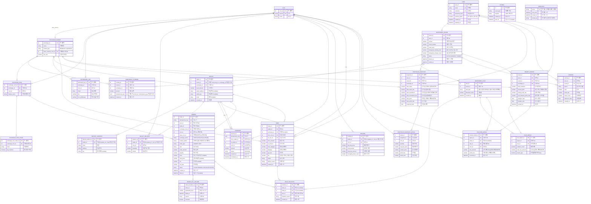

# ERD

```mermaid
erDiagram

    USER {
        id user_id PK "주 식별자"
        string email UK "이메일"
        string nickname UK "닉네임"
        string password_hash "비밀번호 해시"
        boolean portfolio_public "포트폴리오 공개 여부"
        datetime created_at "가입일"
        datetime updated_at "수정일"
    }

    INVESTMENT_ROUND {
        id round_id PK "주 식별자"
        id user_id FK "유저 ID"
        number version "낙관적 잠금 버전"
        number round_number "라운드 번호"
        number initial_seed "시작 시드머니"
        number emergency_funding_limit "1회 긴급 자금 투입 상한"
        number emergency_charge_count "긴급 충전 잔여 횟수"
        string status "ACTIVE BANKRUPT ENDED"
        datetime started_at "라운드 시작일"
        datetime ended_at "라운드 종료일"
    }

    INVESTMENT_RULE {
        id rule_id PK "주 식별자"
        id round_id FK "라운드 ID"
        string rule_type "손절 익절 추격매수금지 물타기제한 과매매제한"
        number threshold_value "기준값"
        datetime created_at "생성일"
    }

    EMERGENCY_FUNDING {
        id funding_id PK "주 식별자"
        id round_id FK "라운드 ID"
        id exchange_id FK "거래소 ID"
        number amount "투입 금액"
        uuid idempotency_key UK "멱등 키 (round_id + idempotency_key 복합 유니크)"
        datetime created_at "투입 시각"
    }

    EXCHANGE_MARKET {
        id exchange_id PK "주 식별자"
        string name "거래소명"
        string market_type "DOMESTIC OVERSEAS"
        id base_currency_coin_id FK "기축통화 코인 ID"
        number fee_rate "기본 수수료율"
    }

    COIN {
        id coin_id PK "주 식별자"
        string symbol UK "티커"
        string name "코인명"
    }

    EXCHANGE_COIN {
        id exchange_coin_id PK "주 식별자"
        id exchange_id FK "거래소 ID"
        id coin_id FK "코인 ID"
        string display_name "거래소별 표시명"
    }

    EXCHANGE_COIN_CHAIN {
        id exchange_coin_chain_id PK "주 식별자"
        id exchange_coin_id FK "거래소-코인 ID"
        string chain "지원 체인"
        boolean tag_required "태그 필수 여부"
    }

    WITHDRAWAL_FEE {
        id withdrawal_fee_id PK "주 식별자"
        id exchange_id FK "거래소 ID"
        id coin_id FK "코인 ID"
        string chain "출금 체인"
        number fee "출금 수수료"
        number min_withdrawal "최소 출금 수량"
    }

    WALLET {
        id wallet_id PK "주 식별자"
        id round_id FK "라운드 ID (round_id + exchange_id 복합 유니크)"
        id exchange_id FK "거래소 ID"
        number seed_amount "시드머니"
        string wallet_address "지갑 주소 (nullable)"
        string wallet_tag "지갑 태그 (nullable)"
        string chain "체인 (nullable)"
        datetime created_at "생성일"
    }

    DEPOSIT_ADDRESS {
        id deposit_address_id PK "주 식별자"
        id wallet_id FK "지갑 ID (wallet_id + chain 복합 유니크)"
        string chain "체인"
        string address "입금 주소"
        string tag "태그 메모 (nullable)"
    }

    WALLET_BALANCE {
        id balance_id PK "주 식별자"
        id wallet_id FK "지갑 ID (wallet_id + coin_id 복합 유니크)"
        id coin_id FK "코인 ID"
        number available "사용 가능 잔고"
        number locked "잠금 잔고"
    }

    TRANSFER {
        id transfer_id PK "주 식별자"
        uuid idempotency_key UK "멱등 키"
        id from_wallet_id FK "출발 지갑 ID"
        id to_wallet_id FK "도착 지갑 ID"
        id coin_id FK "송금 코인 ID"
        number amount "송금 수량"
        string status "SUCCESS"
        datetime created_at "송금 시각"
        datetime completed_at "완료 시각"
    }

    HOLDING {
        id holding_id PK "주 식별자"
        id wallet_id FK "지갑 ID (wallet_id + coin_id 복합 유니크)"
        id coin_id FK "코인 ID"
        number avg_buy_price "평균 매수가"
        number total_quantity "총 보유 수량"
        number total_buy_amount "총 매수 금액"
        number averaging_down_count "물타기 횟수"
    }

    ORDERS {
        id order_id PK "주 식별자"
        string idempotency_key UK "멱등 키"
        id user_id FK "주문 유저 ID"
        id wallet_id FK "주문 지갑 ID"
        id exchange_coin_id FK "거래소-코인 ID"
        id coin_id FK "코인 ID (비정규화)"
        id base_coin_id FK "기축통화 코인 ID (비정규화)"
        string exchange_name "거래소명 (비정규화, tick 매칭용)"
        string market_symbol "거래쌍 심볼 (비정규화, tick 매칭용)"
        string order_type "MARKET LIMIT"
        string side "BUY SELL"
        number order_amount "주문 금액"
        number quantity "주문 수량"
        number price "주문 가격 (지정가, nullable)"
        number filled_price "실제 체결가 (nullable)"
        number fee "수수료 (nullable)"
        number fee_rate "수수료율"
        string status "FILLED PENDING CANCELLED FAILED"
        datetime created_at "주문 시각"
        datetime filled_at "체결 시각 (nullable)"
    }

    RULE_VIOLATION {
        id violation_id PK "주 식별자"
        id order_id FK "주문 ID (nullable)"
        id swap_id FK "스왑 ID (nullable)"
        id rule_id FK "위반 투자 원칙 ID"
        string violation_reason "위반 사유"
        datetime created_at "위반 시각"
    }

    ORDER_FILL_FAILURE {
        id order_fill_failure_id PK "주 식별자"
        id order_id FK "주문 ID"
        number attempted_price "체결 시도 가격"
        datetime failed_at "실패 시각"
        string reason "실패 사유"
        boolean resolved "해결 여부"
    }

    SWAP {
        id swap_id PK "주 식별자"
        id wallet_id FK "지갑 ID"
        id exchange_id FK "거래소 ID (DEX)"
        id from_coin_id FK "스왑 전 코인"
        id to_coin_id FK "스왑 후 코인"
        number from_amount "출발 수량"
        number to_amount "도착 수량"
        number max_slippage "허용 슬리피지"
        number slippage "실제 슬리피지"
        number gas_fee "가스비"
        number fee "플랫폼 수수료 (적용된 결과)"
        string status "성공 실패"
        string failure_reason "실패 사유"
        datetime created_at "스왑 시각"
    }

    PORTFOLIO_SNAPSHOT {
        id snapshot_id PK "주 식별자"
        id user_id FK "유저 ID"
        id round_id FK "라운드 ID"
        id exchange_id FK "거래소 ID"
        number total_asset "총 자산 (거래소 기축통화 단위)"
        number total_asset_krw "총 자산 (원화 환산)"
        number total_investment "총 투입금 (거래소 기축통화 단위)"
        number total_investment_krw "총 투입금 (원화 환산)"
        number total_profit "수익금 (거래소 기축통화 단위)"
        number total_profit_rate "총 수익률"
        date snapshot_date "스냅샷 날짜"
    }

    PORTFOLIO_SNAPSHOT_DETAIL {
        id detail_id PK "주 식별자"
        id snapshot_id FK "스냅샷 ID"
        id coin_id FK "코인 ID"
        number quantity "보유 수량"
        number avg_buy_price "평균 매수가"
        number current_price "당시 현재가"
        number profit_rate "수익률"
        number asset_ratio "자산 비율"
    }

    RANKING {
        id ranking_id PK "주 식별자"
        id user_id FK "유저 ID"
        id round_id FK "라운드 ID"
        string period "일간 주간 월간"
        number rank "순위"
        number profit_rate "수익률"
        number trade_count "거래 횟수"
        date reference_date "기준 날짜"
        datetime created_at "집계 시각"
    }

    REGRET_REPORT {
        id report_id PK "주 식별자"
        id user_id FK "유저 ID"
        id round_id FK "라운드 ID"
        id exchange_id FK "거래소 ID"
        number total_violations "총 위반 횟수"
        number missed_profit "놓친 수익 (기축통화 단위)"
        number actual_profit_rate "실제 수익률"
        number rule_followed_profit_rate "원칙 준수 시 수익률"
        date analysis_start "분석 시작일"
        date analysis_end "분석 종료일"
        datetime created_at "생성일"
    }

    RULE_IMPACT {
        id rule_impact_id PK "주 식별자"
        id report_id FK "리포트 ID"
        id rule_id FK "투자 원칙 ID"
        number violation_count "위반 횟수"
        number total_loss_amount "총 손실 금액 (기축통화 단위)"
        number impact_gap "수익률 영향 차이 (%p)"
    }

    VIOLATION_DETAIL {
        id violation_detail_id PK "주 식별자"
        id report_id FK "리포트 ID"
        id order_id FK "주문 ID (nullable)"
        id rule_id FK "위반 원칙 ID"
        id coin_id FK "코인 ID"
        number loss_amount "규칙 위반 손실 금액 (기축통화 단위)"
        number profit_loss "거래 손익 (기축통화 단위)"
        datetime occurred_at "발생 시각"
    }

    OUTBOX {
        id id PK "주 식별자"
        string event_type "이벤트 타입"
        string payload "JSON 페이로드"
        datetime created_at "생성 시각"
        datetime sent_at "전송 시각 (nullable)"
    }

    %% === 관계 ===
    USER ||--|{ INVESTMENT_ROUND : ""
    INVESTMENT_ROUND ||--|{ WALLET : ""
    USER ||--o{ PORTFOLIO_SNAPSHOT : ""
    USER ||--o{ RANKING : ""
    USER ||--o{ REGRET_REPORT : ""
    INVESTMENT_ROUND ||--|{ INVESTMENT_RULE : ""
    INVESTMENT_ROUND ||--o{ EMERGENCY_FUNDING : ""
    EXCHANGE_MARKET ||--o{ EMERGENCY_FUNDING : ""
    INVESTMENT_ROUND ||--o{ PORTFOLIO_SNAPSHOT : ""
    INVESTMENT_ROUND ||--o{ RANKING : ""
    INVESTMENT_ROUND ||--o{ REGRET_REPORT : ""
    EXCHANGE_MARKET ||--|{ EXCHANGE_COIN : ""
    COIN ||--o| EXCHANGE_MARKET : "base_currency"
    COIN ||--|{ EXCHANGE_COIN : ""
    EXCHANGE_COIN ||--o{ EXCHANGE_COIN_CHAIN : ""
    EXCHANGE_MARKET ||--|{ WITHDRAWAL_FEE : ""
    COIN ||--|{ WITHDRAWAL_FEE : ""
    EXCHANGE_MARKET ||--o{ WALLET : ""
    WALLET ||--o{ DEPOSIT_ADDRESS : ""
    WALLET ||--o{ WALLET_BALANCE : ""
    COIN ||--o{ WALLET_BALANCE : ""
    WALLET ||--o{ TRANSFER : "from"
    WALLET ||--o{ TRANSFER : "to"
    COIN ||--o{ TRANSFER : ""
    WALLET ||--o{ HOLDING : ""
    COIN ||--o{ HOLDING : ""
    WALLET ||--o{ ORDERS : ""
    EXCHANGE_COIN ||--o{ ORDERS : ""
    ORDERS ||--o{ ORDER_FILL_FAILURE : ""
    ORDERS ||--o{ RULE_VIOLATION : ""
    SWAP ||--o{ RULE_VIOLATION : ""
    INVESTMENT_RULE ||--o{ RULE_VIOLATION : ""
    WALLET ||--o{ SWAP : ""
    EXCHANGE_MARKET ||--o{ SWAP : ""
    COIN ||--o{ SWAP : "from"
    COIN ||--o{ SWAP : "to"
    PORTFOLIO_SNAPSHOT ||--|{ PORTFOLIO_SNAPSHOT_DETAIL : ""
    EXCHANGE_MARKET ||--o{ PORTFOLIO_SNAPSHOT : ""
    COIN ||--o{ PORTFOLIO_SNAPSHOT_DETAIL : ""
    EXCHANGE_MARKET ||--o{ REGRET_REPORT : ""
    REGRET_REPORT ||--|{ RULE_IMPACT : ""
    REGRET_REPORT ||--|{ VIOLATION_DETAIL : ""
    INVESTMENT_RULE ||--o{ RULE_IMPACT : ""
    INVESTMENT_RULE ||--o{ VIOLATION_DETAIL : ""
    COIN ||--o{ VIOLATION_DETAIL : ""

    SHEDLOCK {
        string name PK "락 이름 (스케줄러/배치 식별자)"
        datetime lock_until "락 만료 시각"
        datetime locked_at "락 획득 시각"
        string locked_by "락 보유자 (인스턴스 식별자)"
    }
```
