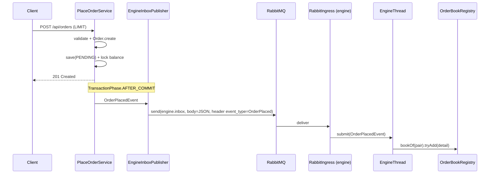
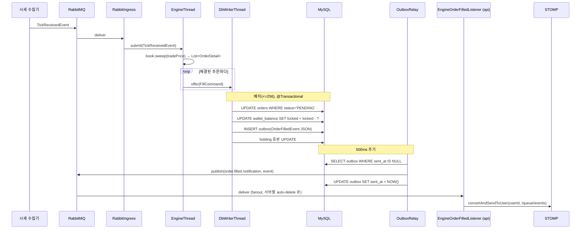
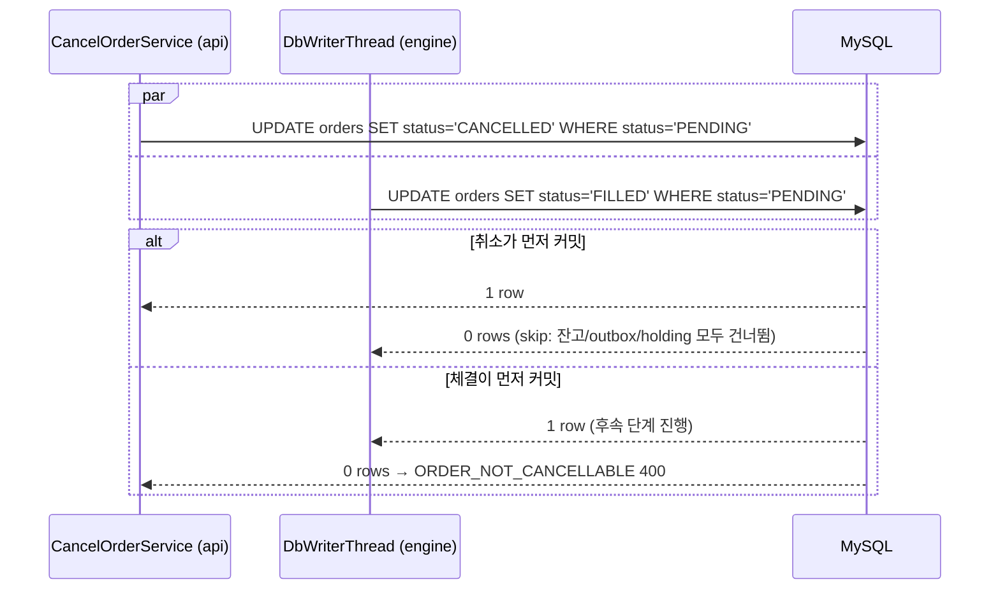

# 개요

지정가 주문이 생성되면 PENDING 상태로 대기한다. 실시간 시세가 체결 조건에 도달하면 해당 주문을 FILLED로 전이시키고 잔고·Holding을 반영한다. 이 과정을 "미체결 주문 매칭"이라 한다.

매칭과 체결 쓰기는 별도 모듈인 **trypto-engine(이하 엔진)** 이 전담한다. `trypto-api`는 주문/취소 이벤트를 엔진에 전달하고, 엔진에서 돌아온 체결 결과를 사용자에게 STOMP로 알리는 역할만 한다.

# 선행 구현 사항

- 지정가 주문 생성 (cex-order.md) — PENDING 상태 주문 생성, 잔고 lock 처리
- 실시간 시세 수집 (realtime-ticker.md) — 수집기가 Redis 캐싱 및 RabbitMQ fanout 으로 시세 이벤트 발행

# 아키텍처 개요

```
   [trypto-api]                         [trypto-collector]
   PlaceOrderService /                  WebSocket 시세 수집
   CancelOrderService                             │
          │                          TickReceivedEvent
    OrderPlacedEvent /                            │
    OrderCanceledEvent                            │
    (AFTER_COMMIT)                                │
          │                                       │
          ▼                                       ▼
   EngineInboxPublisher                    EngineInboxPublisher
   (header event_type=                    (header event_type=
    OrderPlaced | OrderCanceled)           TickReceived)
          │                                       │
          └──────────────┐        ┌───────────────┘
                         ▼        ▼
                 ┌──────────────────────────┐
                 │   RabbitMQ: engine.inbox │  (default exchange → queue 직접 전송)
                 └────────────┬─────────────┘
                              │ concurrency=1 (순서 보장)
                              ▼
                      [trypto-engine]
                      RabbitIngress
                              │
                              ▼
                   단일 엔진 스레드 (EngineThread)
                   In-Memory OrderBook (pair 별)
                          WAL append
                              │
                       매칭 → FillCommand
                              │
                              ▼
                   단일 DbWriter 스레드
                   배치로 db에 체결 반영
                              │
                              ▼
                   OutboxRelay (500ms polling)
                              │
                              ▼
        ┌───────────────────────────────────────────┐
        │ RabbitMQ fanout: order.filled.notification│
        └─────────┬──────────────────────┬──────────┘
                  │                      │
                  ▼                      ▼
         [trypto-api: Server A]   [trypto-api: Server B]
         engine.filled.<uuid>     engine.filled.<uuid>   (각 서버 auto-delete 큐)
                  │                      │
                  ▼                      ▼
         EngineOrderFilledListener   EngineOrderFilledListener
                  │                      │
                  └──────────┬───────────┘
                             ▼
               STOMP convertAndSendToUser(/queue/events)
```

핵심 포인트:

- **체결은 API에서 일어나지 않는다.** API DB 커밋은 주문 생성/취소까지만 담당하고, 체결 시 상태 전이·잔고 차감·Holding 갱신은 엔진 프로세스가 수행한다.
- **엔진이 발행한 체결 이벤트는 모든 API 인스턴스가 동시에 수신하여 웹소켓 푸시한다.

# 메시지 토폴로지

## engine.inbox (API → 엔진)

다음은 API 서버가 지켜야 할 발행 계약이다.

- **Queue**: `engine.inbox` (단일 큐, 발행 순서대로 처리된다고 가정한다).
- **Exchange**: default exchange 로 직접 큐에 전송 — `rabbitTemplate.send("", "engine.inbox", message)`.
- **포맷**: `ObjectMapper` 로 직접 직렬화한 JSON 바이트. `Jackson2JsonMessageConverter` 는 쓰지 않는다 
- **라우팅 식별자**: AMQP 헤더 `event_type` 에 이벤트 종류를 담는다.

API 가 발행하는 이벤트는 두 가지이다.

| event_type | 생산자 | 의미 |
|------------|--------|------|
| `OrderPlaced` | trypto-api `EngineInboxPublisher` | 새 지정가 주문이 오더북에 올라가야 함 |
| `OrderCanceled` | trypto-api `EngineInboxPublisher` | 오더북에서 해당 주문을 제거해야 함 |

## order.filled.notification (엔진 → API)

- **Exchange**: `order.filled.notification` (fanout).
- **Queue**: API 인스턴스가 기동 시 `engine.filled.<uuid8자리>` 이름으로 auto-delete·non-durable 큐를 선언해 exchange 에 바인딩한다.
- **메시지 바디**: `OrderFilledEvent` JSON — `{orderId, userId, executedPrice, quantity, executedAt}`.

fanout + 서버별 전용 큐 구조인 이유는 STOMP 세션이 서버 단위로 고정되기 때문이다. 유저가 붙어있는 서버만 `convertAndSendToUser` 로 실제 푸시할 수 있으므로, 모든 API 인스턴스가 체결 이벤트를 받아서 자기 세션 여부를 확인해야 한다.

# API 쪽 구현

## OrderPlaced / OrderCanceled 발행

`PlaceOrderService`, `CancelOrderService` 는 주문 상태 DB 커밋 직후 도메인 이벤트를 로컬 `ApplicationEventPublisher` 로 발행한다.

```
PlaceOrderService  → new OrderPlacedEvent(order)
CancelOrderService → new OrderCanceledEvent(order)
```

`EngineInboxPublisher` 가 이 이벤트를 `@TransactionalEventListener(phase = AFTER_COMMIT)` 로 받아 RabbitMQ `engine.inbox` 로 발행한다.

- **AFTER_COMMIT 이유**: DB 에 PENDING 으로 기록되기 전에 엔진 오더북에 올라가면, 엔진 체결 → API DB UPDATE 가 "존재하지 않는 주문"을 만날 수 있다.
- **시장가 주문은 보내지 않는다**. 시장가는 API 가 주문 생성 트랜잭션 내에서 즉시 FILLED 로 처리하기 때문이다.

발행 메시지 포맷은 `OrderPlacedEngineMessage`, `OrderCanceledEngineMessage` 가 정의하며, 엔진 `OrderPlacedEvent` / `OrderCanceledEvent` 레코드와 필드 이름이 대칭이다.

## 체결 결과 수신

`EngineOrderFilledListener` 가 자기 서버 전용 큐에서 메세지를 소비하고 STOMP 메시지를 푸시한다.

- API 는 체결 수신 후 DB 를 건드리지 않는다. 모든 영속 변경은 엔진이 이미 끝냈다.
- 엔진→API 전달은 at-least-once 이므로 같은 `orderId` 로 체결 이벤트가 두 번 이상 올 수 있다. 중복 제거는 서버에서 책임지는 것이 맞고, 멱등성 키를 Redis 에 기록해 걸러내는 방식을 염두에 두고 있다 (주문 생성 멱등성에 이미 Redis 를 도입할 예정이라 같은 인프라를 재사용). **현 단계에서는 리스너가 중복 제거 없이 STOMP 로 그대로 흘려보내고, 해당 기능은 후속 작업에서 적용한다.**
- 클라이언트는 현재 보고 있는 `walletId` 와 일치할 때만 로컬 UI 를 갱신한다.
  - 포트폴리오 탭: 해당 holding 만 로컬 갱신 (매수: qty 증가 + avgBuyPrice 재계산, 매도: qty 감소) → 자산요약 재계산
  - 입출금 탭: 해당 coinId 잔고만 로컬 갱신 (available/locked 조정)
- STOMP 설정은 `/topic`, `/queue` 브로커와 `setUserDestinationPrefix("/user")` 를 사용한다.

# 동시성·정합성 논리

체결이 엔진 프로세스에서 일어나므로 API 의 주문 상태 변경(생성·취소)은 엔진의 체결과 경합할 수 있다. 이를 위해 주문의 상태를 변경하기 전에 주문의 상태가 PENDING인지 확인한다.

- API 취소: `UPDATE orders SET status='CANCELLED' WHERE order_id=? AND status='PENDING'`
- 엔진 체결: `UPDATE orders SET status='FILLED' WHERE order_id=? AND status='PENDING'`

API 서버와 엔진이 같은 조건을 쓰므로 DB 레벨에서 하나만 성공한다.

# 크로스 컨텍스트 의존

| UseCase | 호출 위치 | 용도 |
|---------|-----------|------|
| `GetWalletOwnerIdUseCase` | (필요 시 엔진 측 보강용) | walletId → userId 매핑. 엔진은 `OrderPlacedEvent.userId` 를 그대로 전달받으므로 현재는 체결 알림 경로에서 별도 조회가 필요 없다. |
| `FindExchangeCoinMappingUseCase` | `CancelOrderService` | 취소 시 unlock 대상 coin 결정 |
| `FindExchangeDetailUseCase` | `CancelOrderService` | baseCurrencyCoinId / feeRate 조회 |
| `ManageWalletBalanceUseCase` | `CancelOrderService` | lock 해제 |

체결 경로에서 API 가 크로스 컨텍스트 유스케이스를 호출할 일은 없다. 엔진이 walletId·coinId·lockedAmount 를 `OrderPlaced` 시점에 미리 받아 두었다가 체결 시 그대로 DB 업데이트에 쓰기 때문이다.

# 시퀀스 다이어그램

## 주문 생성 → 엔진 등록



## 시세 수신 → 체결



## 취소와 체결 경합


