# 개요

거래소 간 코인 송금을 시뮬레이션한다. 잘못된 주소/체인/태그 누락 등 실제 송금에서 발생하는 실패 상황을 체험할 수 있다.

# 목적

- 사용자가 거래소 간 코인 이동을 안전하게 연습할 수 있도록 한다
- 잘못된 송금이 실패가 아니라 "동결"로 처리되어, 현실에서 자금을 잃는 상황을 시뮬레이션한다
- 출금 수수료, 최소 출금 수량, 체인 호환성 등 실제 거래소 규칙을 학습할 수 있도록 한다

# 선행 구현 사항

- 입금 주소 조회 API (`GET /api/wallets/{walletId}/deposit-address`) — `docs/wallet/deposit-address.md`
- 잔고 관리 (available/locked) — `docs/trading/cex-order.md`

# 도메인 규칙

## 검증 단계 (실패 시 4xx 에러)

검증에 실패하면 송금이 생성되지 않고 에러를 반환한다.

1. **멱등성 검사**: `clientTransferId`로 기존 송금 조회. 존재하면 기존 결과 반환
2. **지갑 조회 + 소유권 검증**: 출발 지갑이 존재하고 요청자 소유인지 확인
3. **KRW 송금 불가 확인**: 송금 코인이 출발 거래소의 기축통화이면서 KRW인 경우 거부
4. **출발 거래소 체인 지원 확인**: 출발 거래소가 해당 코인+체인을 지원하는지 확인
5. **수수료 + 최소 출금 수량 조회**: 출발 거래소의 해당 코인+체인에 대한 수수료와 최소 출금 수량 조회
6. **최소 출금 수량 검증**: 송금 수량 ≥ 최소 출금 수량
7. **잔고 검증**: 가용 잔고 ≥ 송금 수량 + 수수료

## 실패 판정 단계 (검증 통과 후)

검증을 모두 통과한 후, 실제 송금이 성공할지 동결될지 판정한다. 동결은 에러가 아니라 시뮬레이션 결과이므로 201 Created를 반환한다.

1. **주소 매칭**: 입력한 `toAddress`로 라운드 내 `DEPOSIT_ADDRESS`를 역조회한다
   - 일치하는 주소가 없으면 → FROZEN (WRONG_ADDRESS)
2. **체인 호환**: 도착 거래소가 해당 코인+체인을 지원하는지 확인한다
   - 미지원이면 → FROZEN (WRONG_CHAIN)
3. **태그 검증**: 해당 체인이 `tag_required`인데 `toTag`가 비어있으면 → FROZEN (MISSING_TAG)
4. 모두 통과 → SUCCESS

## 잔고 변동

| 결과 | 출발 지갑 | 도착 지갑 |
|------|----------|----------|
| SUCCESS | deductAvailable(amount + fee) | addAvailable(amount) |
| FROZEN | lock(amount + fee) | 변동 없음 |
| REFUNDED | unlock(amount + fee) | 변동 없음 |

- FROZEN 시 `toWalletId`는 null이다 (도착 지갑을 특정하지 못했거나 체인 미지원)
- REFUNDED는 동결 해제 배치가 24시간 후 자동 처리한다

## Transfer 도메인 모델

```
Transfer (Aggregate Root)
├── transferId: Long
├── idempotencyKey: UUID
├── fromWalletId: Long
├── toWalletId: Long (nullable — FROZEN일 때 null 가능)
├── coinId: Long
├── chain: Chain (VO)
├── toAddress: String
├── toTag: String (nullable)
├── amount: BigDecimal
├── fee: BigDecimal
├── status: TransferStatus (SUCCESS / FROZEN / REFUNDED)
├── failureReason: TransferFailureReason (WRONG_ADDRESS / WRONG_CHAIN / MISSING_TAG, nullable)
├── frozenUntil: LocalDateTime (nullable)
└── createdAt: LocalDateTime
```

**팩토리 메서드:**
- `Transfer.success(...)` — 성공 송금 생성
- `Transfer.frozen(..., failureReason)` — 동결 송금 생성 (frozenUntil = now + 24h)

**상태 전이:**
- `refund()` — FROZEN → REFUNDED (배치에서 호출)

# API 명세

`POST /api/transfers`

## Request Body

| 필드 | 타입 | 필수 | 설명 |
|------|------|------|------|
| clientTransferId | UUID | O | 멱등성 키 (클라이언트 생성) |
| fromWalletId | Long | O | 출발 지갑 ID |
| coinId | Long | O | 송금 코인 ID |
| chain | String | O | 사용 체인 (예: "ERC-20", "Bitcoin") |
| toAddress | String | O | 도착 주소 (직접 입력) |
| toTag | String | X | 태그/메모 |
| amount | BigDecimal | O | 송금 수량 |

## Request

```json
{
  "clientTransferId": "550e8400-e29b-41d4-a716-446655440001",
  "fromWalletId": 1,
  "coinId": 1,
  "chain": "Bitcoin",
  "toAddress": "bc1qar0srrr7xfkvy5l643lydnw9re59gtzzwf5mdq",
  "toTag": null,
  "amount": 0.005
}
```

## Response

요청에 포함된 값(coinId, chain, amount 등)은 프론트가 이미 알고 있으므로 응답에서 제외한다. 서버만 알 수 있는 필드만 반환한다.

| 필드 | 타입 | 설명 |
|------|------|------|
| transferId | Long | 생성된 송금 ID (이체 내역 prepend 시 key·cursor로 사용) |
| status | String | `SUCCESS` / `FROZEN` |
| fee | BigDecimal | 출금 수수료 |
| failureReason | String? | `WRONG_ADDRESS` / `WRONG_CHAIN` / `MISSING_TAG` (SUCCESS이면 null) |
| frozenUntil | LocalDateTime? | 동결 해제 예정 시각 (SUCCESS이면 null) |

### SUCCESS

```json
{
  "status": 201,
  "code": "CREATED",
  "message": "송금이 완료되었습니다.",
  "data": {
    "transferId": 1,
    "status": "SUCCESS",
    "fee": 0.0005,
    "failureReason": null,
    "frozenUntil": null
  }
}
```

### FROZEN

```json
{
  "status": 201,
  "code": "CREATED",
  "message": "송금 자금이 동결되었습니다.",
  "data": {
    "transferId": 2,
    "status": "FROZEN",
    "fee": 0.0008,
    "failureReason": "WRONG_ADDRESS",
    "frozenUntil": "2026-03-04T14:30:00"
  }
}
```

## 에러 응답

| code | status | 설명 |
|------|--------|------|
| WALLET_NOT_FOUND | 404 | 지갑을 찾을 수 없음 |
| BASE_CURRENCY_NOT_TRANSFERABLE | 400 | KRW는 송금할 수 없음 |
| UNSUPPORTED_CHAIN | 400 | 출발 거래소가 해당 코인+체인을 지원하지 않음 |
| BELOW_MIN_WITHDRAWAL | 400 | 최소 출금 수량 미달 |
| INSUFFICIENT_BALANCE | 400 | 잔고 부족 (가용 잔고 < 송금 수량 + 수수료) |

# 포트/어댑터

## Input Port (transfer 컨텍스트)

| 컴포넌트 | 책임 |
|----------|------|
| TransferCoinUseCase | 송금 유스케이스 |
| TransferCoinService | 송금 오케스트레이션 (검증 → 실패 판정 → 잔고 변동 → 저장) |

## Output Port (transfer 컨텍스트)

| 컴포넌트 | 책임 |
|----------|------|
| TransferPersistencePort | 송금 저장, 멱등 키 조회 |

## 크로스 컨텍스트 포트

| 컴포넌트 | 방향 | 책임 |
|----------|------|------|
| TransferWalletPort | transfer → wallet | 지갑 조회, 잔고 차감/추가/잠금 |
| TransferDepositPort | transfer → wallet | 입금 주소로 지갑 역조회 (라운드 내) |
| WithdrawalFeePort | transfer → marketdata | 수수료 + 최소 출금 수량 조회 |
| ExchangeCoinChainPort | transfer → marketdata | 체인 지원 확인, 태그 필수 여부 조회 |

# 시퀀스 다이어그램

```mermaid
sequenceDiagram
    participant Client
    participant Controller as TransferController
    participant Service as TransferCoinService
    participant TransferAdapter as TransferPersistenceAdapter
    participant WalletAdapter as TransferWalletAdapter
    participant DepositAdapter as TransferDepositAdapter
    participant FeeAdapter as WithdrawalFeeAdapter
    participant ChainAdapter as ExchangeCoinChainAdapter
    participant Transfer
    participant MySQL

    Client->>Controller: POST /api/transfers
    Controller->>Service: transferCoin(command)

    rect rgb(60, 60, 60)
        Note over Service,MySQL: STEP 01 멱등성 검사
    end
    Service->>TransferAdapter: findByIdempotencyKey(clientTransferId)
    TransferAdapter->>MySQL: SELECT by idempotency_key

    rect rgb(60, 60, 60)
        Note over Service,MySQL: STEP 02 지갑 조회 + 소유권 검증
    end
    Service->>WalletAdapter: getWallet(fromWalletId)
    WalletAdapter->>MySQL: SELECT wallet

    rect rgb(60, 60, 60)
        Note over Service: STEP 03 KRW 송금 불가 확인
    end
    Note over Service: baseCurrencyCoinId == coinId이면서 KRW이면 에러

    rect rgb(60, 60, 60)
        Note over Service,MySQL: STEP 04 출발 거래소 체인 지원 확인
    end
    Service->>ChainAdapter: getExchangeCoinChain(exchangeId, coinId, chain)
    ChainAdapter->>MySQL: SELECT exchange_coin_chain

    rect rgb(60, 60, 60)
        Note over Service,MySQL: STEP 05 수수료 + 최소 출금 수량 조회
    end
    Service->>FeeAdapter: getWithdrawalFee(exchangeId, coinId, chain)
    FeeAdapter->>MySQL: SELECT withdrawal_fee
    Note over Service: amount < minWithdrawal이면 에러

    rect rgb(60, 60, 60)
        Note over Service,MySQL: STEP 06 잔고 검증
    end
    Service->>WalletAdapter: getAvailableBalance(fromWalletId, coinId)
    WalletAdapter->>MySQL: SELECT available
    Note over Service: available < amount + fee이면 에러

    rect rgb(60, 60, 60)
        Note over Service,MySQL: STEP 07 실패 판정
    end
    Service->>DepositAdapter: findWalletByAddress(roundId, chain, toAddress)
    DepositAdapter->>MySQL: SELECT deposit_address + wallet

    alt 주소 불일치
        Service->>Transfer: Transfer.frozen(WRONG_ADDRESS)
    else 도착 거래소 체인 미지원
        Service->>ChainAdapter: findExchangeCoinChain(toExchangeId, coinId, chain)
        Note over Service: 미지원이면 FROZEN(WRONG_CHAIN)
        Service->>Transfer: Transfer.frozen(WRONG_CHAIN)
    else 태그 누락
        Note over Service: tagRequired && toTag 비어있음
        Service->>Transfer: Transfer.frozen(MISSING_TAG)
    else 모두 통과
        Service->>Transfer: Transfer.success(...)
    end

    rect rgb(60, 60, 60)
        Note over Service,MySQL: STEP 08 잔고 변동
    end
    alt SUCCESS
        Service->>WalletAdapter: deductAvailable(fromWalletId, coinId, amount + fee)
        Service->>WalletAdapter: addAvailable(toWalletId, coinId, amount)
    else FROZEN
        Service->>WalletAdapter: lock(fromWalletId, coinId, amount + fee)
    end
    WalletAdapter->>MySQL: UPDATE wallet_balance

    rect rgb(60, 60, 60)
        Note over Service,MySQL: STEP 09 송금 저장
    end
    Service->>TransferAdapter: save(transfer)
    TransferAdapter->>MySQL: INSERT transfer

    Service-->>Controller: Transfer
    Controller-->>Client: 201 Created
```


