# 개요

거래소 지갑의 코인 입금 주소를 조회한다.

# 목적

- 사용자가 송금 전 도착 거래소의 입금 주소를 확인하고 복사할 수 있도록 한다
- 입금 주소는 (지갑, 코인) 단위로 고유하며, 최초 조회 시 생성하고 이후 동일 주소를 반환한다

# 도메인 규칙

## 입금 주소 생성

- 입금 주소는 `getOrCreate` 패턴으로 동작한다
  - DB에 (walletId, coinId)으로 조회 → 존재하면 반환
  - 없으면 SHA-256(walletId + coinId) 시드 기반으로 주소를 생성하고 DB에 저장 후 반환
- 네트워크(체인)와 태그는 사용하지 않는다 (시뮬레이션 단순화)

## 입금 제한

- KRW는 암호화폐가 아니므로 입금 주소가 없다
- 국내 거래소(업비트, 빗썸)의 기축통화(KRW)는 입금 주소 발급이 차단된다
- 바이낸스의 기축통화(USDT)는 암호화폐이므로 입금 주소 발급이 가능하다

## 컨텍스트 소속

- **wallet 컨텍스트** — 입금 주소는 지갑의 속성이다

# API 명세

`GET /api/wallets/{walletId}/deposit-address?coinId={coinId}`

## Query Parameters

| 파라미터 | 타입 | 필수 | 설명 |
|----------|------|------|------|
| coinId | Long | O | 코인 ID |

## Response

```json
{
  "status": 200,
  "code": "OK",
  "message": "조회 성공",
  "data": {
    "depositAddressId": 1,
    "walletId": 1,
    "address": "a1b2c3d4e5f6..."
  }
}
```

## 에러 응답

| code | status | 설명 |
|------|--------|------|
| WALLET_NOT_FOUND | 404 | 지갑을 찾을 수 없음 |
| BASE_CURRENCY_NOT_TRANSFERABLE | 400 | KRW는 송금할 수 없음 |

# 포트/어댑터

## Input Port (wallet 컨텍스트)

| 컴포넌트 | 책임 |
|----------|------|
| IssueDepositAddressUseCase | 입금 주소 발급 유스케이스 |
| IssueDepositAddressService | getOrCreate 오케스트레이션 |

## Output Port (wallet 컨텍스트)

| 컴포넌트 | 책임 |
|----------|------|
| DepositAddressCommandPort | 입금 주소 저장 |
| DepositAddressQueryPort | 입금 주소 조회 |
| WalletQueryPort | 지갑 조회 |

## 크로스 컨텍스트 포트

| 컴포넌트 | 방향 | 책임 |
|----------|------|------|
| FindExchangeDetailUseCase | wallet → marketdata | 거래소 기축통화/국내여부 확인 |

# 시퀀스 다이어그램

```mermaid
sequenceDiagram
    participant Client
    participant Controller as DepositAddressController
    participant Service as IssueDepositAddressService
    participant WalletAdapter as WalletQueryAdapter
    participant ExchangeUseCase as FindExchangeDetailUseCase
    participant AddressAdapter as DepositAddressAdapter
    participant MySQL

    Client->>Controller: GET /api/wallets/{walletId}/deposit-address?coinId=
    Controller->>Service: issueDepositAddress(command)

    rect rgb(60, 60, 60)
        Note over Service,MySQL: STEP 01 지갑 조회
    end
    Service->>WalletAdapter: findById(walletId)
    WalletAdapter->>MySQL: SELECT wallet

    rect rgb(60, 60, 60)
        Note over Service,MySQL: STEP 02 기축통화 검증
    end
    Service->>ExchangeUseCase: findExchangeDetail(exchangeId)
    Note over Service: fiatCurrency && baseCurrencyCoinId == coinId이면 에러

    rect rgb(60, 60, 60)
        Note over Service,MySQL: STEP 03 입금 주소 조회 또는 생성
    end
    Service->>AddressAdapter: findByWalletIdAndCoinId(walletId, coinId)
    AddressAdapter->>MySQL: SELECT deposit_address
    alt 주소 존재
        AddressAdapter-->>Service: depositAddress
    else 최초 조회
        Note over Service: SHA-256(walletId + coinId)으로 주소 생성
        Service->>AddressAdapter: save(depositAddress)
        AddressAdapter->>MySQL: INSERT deposit_address
    end

    Service-->>Controller: DepositAddress
    Controller-->>Client: 200 OK
```


