# 개요

지갑의 잔고 목록을 조회하는 REST API다. 사용자가 보유한 코인의 available(사용 가능)과
locked(잠금) 잔고를 반환한다. 기축통화 잔고는 별도 필드로 분리하여 제공한다.

# 목적

- 입출금 탭에서 사용자의 보유 잔고를 제공한다
- 프론트엔드가 거래소 상장 코인 목록(캐싱)과 잔고를 coinId로 매핑하여 화면을 구성한다
- 현재가는 WebSocket으로 수신하므로 이 API에 포함하지 않는다


# 검증

| 항목 | 규칙 | 실패 시 에러 |
|------|------|-------------|
| 지갑 존재 | 해당 walletId의 지갑이 존재해야 한다 | `WALLET_NOT_FOUND` |
| 지갑 소유권 | 지갑의 roundId로 라운드를 조회하여 round.userId == userId 검증 | `WALLET_NOT_OWNED` |


# 정렬

- 서버는 정렬하지 않는다
- 클라이언트에서 처리한다

# 크로스 컨텍스트 의존

| From → To | UseCase | 용도 |
|-----------|---------|------|
| Wallet → InvestmentRound | FindRoundInfoUseCase | 소유권 검증 (wallet.roundId → round.userId) |
| Wallet → MarketData | FindExchangeDetailUseCase | 거래소 기축통화(baseCurrencyCoinId) 조회 |
| Wallet → MarketData | FindCoinInfoUseCase | 기축통화 심볼 조회 |

# 같은 컨텍스트 내부 의존
- WalletQueryPort: 지갑 조회
- WalletBalanceQueryPort: 지갑 전체 잔고 조회

# API 명세

## 참고사항

- 거래소 탭 전환은 클라이언트가 walletId를 바꿔서 호출한다 (walletId는 라운드 응답에 포함)
- 거래소 상장 코인 목록은 별도 API(`GET /api/exchanges/{exchangeId}/coins`)로 캐싱한다
- 현재가는 WebSocket `/topic/prices.{exchangeId}`로 수신한다
- 프론트엔드가 코인 목록 + 잔고 + 현재가를 coinId로 조합하여 렌더링한다

## REST API

`GET /api/users/{userId}/wallets/{walletId}/balances`

### Path Parameters

| 필드 | 타입 | 필수 | 설명 |
|------|------|------|------|
| userId | Long | O | 사용자 ID |
| walletId | Long | O | 조회할 지갑 ID |

### Response

```json
{
  "status": 200,
  "code": "SUCCESS",
  "message": "잔고를 조회했습니다.",
  "data": {
    "exchangeId": 1,
    "baseCurrencySymbol": "KRW",
    "baseCurrencyAvailable": 2450000,
    "baseCurrencyLocked": 150000,
    "balances": [
      {
        "coinId": 1,
        "available": 0.052341,
        "locked": 0.001
      },
      {
        "coinId": 2,
        "available": 1.245,
        "locked": 0
      }
    ]
  }
}
```

### 필드 설명

**data**

| 필드 | 타입 | 설명 |
|------|------|------|
| exchangeId | Long | 거래소 ID |
| baseCurrencySymbol | String | 기축통화 심볼 (KRW, USDT) |
| baseCurrencyAvailable | BigDecimal | 기축통화 사용 가능 잔고 |
| baseCurrencyLocked | BigDecimal | 기축통화 잠금 잔고 |

**balances[]**

| 필드 | 타입 | 설명 |
|------|------|------|
| coinId | Long | 코인 ID (거래소 코인 목록의 coinId와 매칭) |
| available | BigDecimal | 사용 가능 잔고 |
| locked | BigDecimal | 잠금 잔고 |

### 에러 응답

| code | status | 설명 |
|------|--------|------|
| WALLET_NOT_FOUND | 404 | 지갑을 찾을 수 없음 |
| WALLET_NOT_OWNED | 403 | 지갑 소유자가 아님 |

# 시퀀스 다이어그램

```mermaid
sequenceDiagram
    participant Client
    participant Controller as WalletBalanceController
    participant Service as GetWalletBalancesService
    participant WalletPort as WalletQueryPort
    participant FindRound as FindRoundInfoUseCase
    participant FindExchange as FindExchangeDetailUseCase
    participant FindCoinInfo as FindCoinInfoUseCase
    participant BalancePort as WalletBalanceQueryPort
    participant MySQL

    Client->>Controller: GET /api/users/{userId}/wallets/{walletId}/balances
    Controller->>Service: getWalletBalances(userId, walletId)

    rect rgb(60, 60, 60)
        Note over Service,MySQL: STEP 01 지갑 조회
    end
    Service->>WalletPort: findById(walletId)
    WalletPort->>MySQL: SELECT wallet
    WalletPort-->>Service: WalletInfo (roundId, exchangeId)

    rect rgb(60, 60, 60)
        Note over Service,MySQL: STEP 02 소유권 검증
    end
    Service->>FindRound: findById(roundId)
    FindRound->>MySQL: SELECT round
    FindRound-->>Service: RoundInfoResult (userId)
    Note over Service: round.userId == userId 검증

    rect rgb(60, 60, 60)
        Note over Service,MySQL: STEP 03 거래소 기축통화 조회
    end
    Service->>FindExchange: findExchangeDetail(exchangeId)
    FindExchange->>MySQL: SELECT exchange
    FindExchange-->>Service: ExchangeDetailResult (baseCurrencyCoinId)

    rect rgb(60, 60, 60)
        Note over Service,MySQL: STEP 04 지갑 전체 잔고 조회
    end
    Service->>BalancePort: findByWalletId(walletId)
    BalancePort->>MySQL: SELECT wallet_balance WHERE wallet_id = ?
    BalancePort-->>Service: List<WalletBalanceInfo> (coinId, available, locked)

    rect rgb(60, 60, 60)
        Note over Service,MySQL: STEP 05 기축통화 심볼 조회
    end
    Service->>FindCoinInfo: findByIds({baseCurrencyCoinId})
    FindCoinInfo->>MySQL: SELECT coin
    FindCoinInfo-->>Service: CoinInfoResult (symbol)

    Note over Service: 기축통화 잔고 분리 + 나머지 잔고 목록 구성
    Service-->>Controller: WalletBalancesResult
    Controller-->>Client: 200 OK
```


