# 개요

투자 라운드의 복기 그래프 데이터를 조회한다. 거래소별로 실제 자산 추이, 규칙 준수 시 시뮬레이션 자산 추이, BTC 홀드 벤치마크, 위반 지점 마커를 제공한다.

# 목적

- 거래소별 일별 자산 추이 그래프로 실제 투자 성과를 시각화한다
- "원칙을 지켰다면?" 시뮬레이션 추이(분홍 점선)를 실제 추이와 겹쳐 보여준다
- BTC 홀드 벤치마크(주황 실선)로 단순 보유 대비 성과를 비교한다
- 위반 지점 마커(빨간 점)로 그래프 위에 위반 발생 시점을 표시한다

# 선행 구현 사항

## 복기 리포트

복기 그래프 데이터는 [regret-report.md](regret-report.md)의 리포트가 배치로 생성되어 있어야 한다.

- 리포트의 위반 거래 `loss_amount` 데이터를 기반으로 시뮬레이션 자산 추이를 계산한다
- 리포트가 없으면 `REPORT_NOT_FOUND` 에러를 반환한다

## 포트폴리오 스냅샷

일별 자산 추이를 그래프로 표현하기 위해 `PORTFOLIO_SNAPSHOT`이 배치로 적재되어 있어야 한다. 배치로 적재된 날짜까지의 데이터만 제공한다 (당일 실시간 계산 없음).

스냅샷 배치 상세는 [portfolio-snapshot-batch.md](../../../../Desktop/batch/portfolio-snapshot-batch.md)를 참조한다.

# 복기 그래프 데이터 조회

## 구성 요소

요청한 거래소의 다음 데이터를 제공한다. 거래소마다 기축통화가 다르므로(국내: KRW, 바이낸스: USDT) 거래소별로 요청한다.

1. **자산 추이 (Asset History)**: 일별 실제 자산(`actualAsset`), 규칙 준수 시 시뮬레이션 자산(`ruleFollowedAsset`), BTC 홀드 벤치마크(`btcHoldAsset`)
2. **위반 지점 마커 (Violation Markers)**: 위반 거래가 발생한 날짜와 해당 시점의 자산값

## 조회 조건

- `roundId`로 해당 투자 라운드의 그래프 데이터를 조회한다
- 라운드 소유자만 조회할 수 있다 (본인 라운드 검증)
- 해당 라운드의 복기 리포트가 생성되어 있어야 한다

## 처리 로직

### 실제 자산 추이

`PORTFOLIO_SNAPSHOT` 테이블에서 `round_id` + `exchange_id`로 해당 거래소의 일별 총 자산을 조회한다.

### 규칙 준수 시 시뮬레이션 자산 계산

위반이 없었다면의 가상 자산 추이를 일별로 계산한다.

```
ruleFollowedAsset[day] = actualAsset[day] + Σ(위반 손실, 해당일까지 누적)
```

근사 계산이다. 완전한 포트폴리오 재시뮬레이션 대신 누적 손실 가산 방식을 사용한다. 실제로는 손실이 복리로 영향을 미치지만, 계산 복잡도 대비 직관적인 근사치를 제공한다.

**계산 절차:**

1. 복기 리포트의 `VIOLATION_DETAIL` 레코드에서 해당 거래소의 위반 거래 `loss_amount`와 `occurredAt`을 가져온다
2. 각 스냅샷 날짜에 대해, 해당일 이전(포함)에 발생한 위반 거래의 `loss_amount`를 누적 합산한다
3. `ruleFollowedAsset[day] = actualAsset[day] + cumulativeLoss[day]`

### BTC 홀드 벤치마크 계산

해당 거래소의 시드머니 전액으로 BTC만 매수하여 보유했을 때의 가상 자산 추이를 계산한다.

```
btcQuantity = seedMoney / btcPriceAtRoundStart
btcHoldAsset[day] = btcQuantity × btcPriceAtDay
```

- 국내 거래소: KRW 마켓 BTC 종가 기준
- 바이낸스: USDT 마켓 BTC 종가 기준
- 수수료는 적용하지 않는다 (벤치마크 비교 목적)

**계산 절차:**

1. 해당 거래소의 시드머니와 라운드 시작일의 BTC 가격을 조회한다
2. `btcQuantity = seedMoney / btcPriceAtRoundStart`
3. 각 스냅샷 날짜의 BTC 가격을 조회하여 `btcHoldAsset`을 계산한다

**BTC 가격 데이터 소스:**
- InfluxDB에 저장된 BTC 시세 이력에서 일별 종가를 조회한다

### 위반 마커 생성

복기 리포트의 위반 거래 목록을 기반으로 그래프 위 마커 데이터를 생성한다.

1. 해당 거래소의 `VIOLATION_DETAIL`에서 `occurredAt` 날짜를 스냅샷 날짜에 매핑한다
2. 해당 스냅샷 날짜의 `actualAsset`을 `assetValue`로 설정한다
3. 같은 날짜에 여러 위반이 있으면 **날짜당 하나로 합친다**. 세부 내용은 리포트 API의 `violationDetails`에서 확인한다

### 규칙 토글 시뮬레이션

프론트엔드에서 개별 규칙을 켜고 끌 때의 시뮬레이션 라인 변화는 **클라이언트에서 가중 보간**으로 처리한다.

- 서버는 전체 규칙 준수 시 `ruleFollowedAsset`만 제공한다
- 각 규칙의 가중치(`RULE_IMPACT_WEIGHTS`)를 프론트엔드에서 관리한다
- 규칙 토글 시: `toggledAsset[day] = actual[day] + (ruleFollowed[day] - actual[day]) × Σ(활성 규칙 가중치)`
- 이 계산은 정확한 재시뮬레이션이 아닌 근사치이며, 사용자에게 직관적인 시각적 피드백을 제공하는 것이 목적이다

## API 명세

### 참고사항

- 이 API는 순수 조회이다. 복기 리포트가 사전에 생성되어 있어야 한다
- 자산 추이 데이터는 일별 단위로 반환한다. 그래프 세밀도 조절(x축 라벨 간격 등)은 클라이언트에서 처리한다
- 거래소별로 요청한다

`GET /api/rounds/{roundId}/regret/chart?exchangeId={exchangeId}`

### Path Parameter

| 필드 | 타입 | 필수 | 설명 |
|------|------|------|------|
| roundId | Long | O | 투자 라운드 ID |

### Query Parameter

| 필드 | 타입 | 필수 | 설명 |
|------|------|------|------|
| exchangeId | Long | O | 거래소 ID |

### Request

```
GET /api/rounds/1/regret/chart?exchangeId=1
```

### Response

```json
{
  "status": 200,
  "code": "OK",
  "message": "복기 그래프 데이터를 조회했습니다.",
  "data": {
    "roundId": 1,
    "exchangeId": 1,
    "exchangeName": "업비트",
    "currency": "KRW",
    "totalDays": 42,

    "assetHistory": [
      {
        "snapshotDate": "2026-01-15",
        "actualAsset": 10000000,
        "ruleFollowedAsset": 10000000,
        "btcHoldAsset": 10000000
      },
      {
        "snapshotDate": "2026-01-22",
        "actualAsset": 10150000,
        "ruleFollowedAsset": 10535000,
        "btcHoldAsset": 10230000
      },
      {
        "snapshotDate": "2026-02-25",
        "actualAsset": 10400000,
        "ruleFollowedAsset": 11293837,
        "btcHoldAsset": 11180000
      }
    ],

    "violationMarkers": [
      {
        "snapshotDate": "2026-01-22",
        "assetValue": 10150000
      },
      {
        "snapshotDate": "2026-02-10",
        "assetValue": 10200000
      }
    ]
  }
}
```

### 응답 필드 상세

#### 최상위 필드

| 필드 | 타입 | 설명 |
|------|------|------|
| roundId | Long | 투자 라운드 ID |
| exchangeId | Long | 거래소 ID |
| exchangeName | String | 거래소 이름 |
| currency | String | 기축통화 (KRW, USDT) |
| totalDays | Integer | 분석 기간 총 일수. 첫 스냅샷 ~ 마지막 스냅샷 날짜 차이 + 1 |

#### assetHistory[]

| 필드 | 타입 | 설명 |
|------|------|------|
| snapshotDate | LocalDate | 스냅샷 날짜 |
| actualAsset | BigDecimal | 해당일 실제 총 자산 (기축통화 단위) |
| ruleFollowedAsset | BigDecimal | 해당일 규칙 준수 시 시뮬레이션 총 자산 (기축통화 단위) |
| btcHoldAsset | BigDecimal | 해당일 BTC 홀드 시 자산 (기축통화 단위) |

#### violationMarkers[]

| 필드 | 타입 | 설명 |
|------|------|------|
| snapshotDate | LocalDate | 위반 발생 날짜. 같은 날 여러 위반은 하나로 합친다 |
| assetValue | BigDecimal | 해당 시점의 실제 자산값 (기축통화 단위). 마커의 y좌표 |

### 에러 응답

| code | status | 설명 |
|------|--------|------|
| ROUND_NOT_FOUND | 404 | 투자 라운드를 찾을 수 없음 |
| ROUND_ACCESS_DENIED | 403 | 본인의 라운드가 아님 |
| EXCHANGE_NOT_FOUND | 404 | 해당 거래소가 라운드에 존재하지 않음 |
| REPORT_NOT_FOUND | 404 | 복기 리포트가 아직 생성되지 않음 |
| SNAPSHOT_NOT_FOUND | 404 | 포트폴리오 스냅샷이 아직 생성되지 않음 |

# 시퀀스 다이어그램

```mermaid
sequenceDiagram
    participant Client
    participant Controller as RegretController
    participant Service as GetRegretChartService
    participant RoundAdapter as InvestmentRoundAdapter
    participant ReportAdapter as RegretReportPersistenceAdapter
    participant SnapshotAdapter as PortfolioSnapshotAdapter
    participant BtcPriceAdapter as BtcPriceHistoryAdapter
    participant MySQL
    participant InfluxDB

    Client->>Controller: GET /api/rounds/{roundId}/regret/chart?exchangeId={exchangeId}
    Controller->>Service: getRegretChart(query)

    rect rgb(60, 60, 60)
        Note over Service,MySQL: STEP 01 라운드 조회 + 소유자 검증
    end
    Service->>RoundAdapter: getRound(roundId)
    RoundAdapter->>MySQL: SELECT investment_round
    Note over Service: 소유자 검증 (userId 비교)

    rect rgb(60, 60, 60)
        Note over Service,MySQL: STEP 02 복기 리포트 조회
    end
    Service->>ReportAdapter: getByRoundIdAndExchangeId(roundId, exchangeId)
    ReportAdapter->>MySQL: SELECT regret_report + violation_detail WHERE round_id AND exchange_id
    Note over Service: 리포트 없으면 REPORT_NOT_FOUND 에러

    rect rgb(60, 60, 60)
        Note over Service,MySQL: STEP 03 자산 추이 조회
    end
    Service->>SnapshotAdapter: findByRoundIdAndExchangeId(roundId, exchangeId)
    SnapshotAdapter->>MySQL: SELECT portfolio_snapshot WHERE round_id AND exchange_id ORDER BY snapshot_date

    rect rgb(60, 60, 60)
        Note over Service: STEP 04 규칙 준수 시 시뮬레이션 자산 계산
    end
    Note over Service: 위반 거래의 loss_amount를 일별 누적 합산
    Note over Service: ruleFollowedAsset[day] = actualAsset[day] + cumulativeLoss[day]

    rect rgb(60, 60, 60)
        Note over Service,InfluxDB: STEP 05 BTC 홀드 벤치마크 계산
    end
    Service->>BtcPriceAdapter: findBtcDailyPrices(startDate, endDate, market)
    BtcPriceAdapter->>InfluxDB: QUERY btc_price (일별 종가)
    Note over Service: btcQuantity = seedMoney / btcPriceAtStart
    Note over Service: btcHoldAsset[day] = btcQuantity × btcPriceAtDay

    rect rgb(60, 60, 60)
        Note over Service: STEP 06 위반 마커 생성
    end
    Note over Service: 위반 거래의 occurredAt을 스냅샷 날짜에 매핑
    Note over Service: 같은 날짜는 하나로 합침

    Service-->>Controller: RegretChartResult
    Controller-->>Client: 200 OK
```


