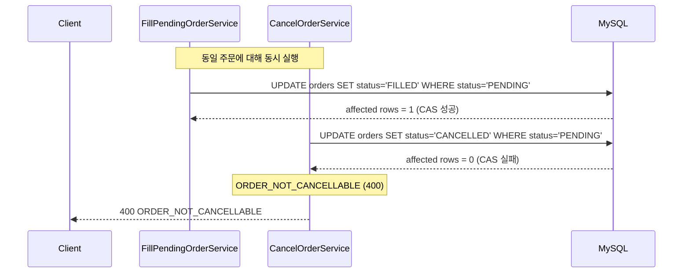

# 개요

미체결(PENDING) 상태인 지정가 주문을 취소한다. 주문 상태를 CAS UPDATE로 원자적으로 CANCELLED로 전이하고, lock된 잔고를 해제하며, Redis 미체결 주문 캐시에서 해당 주문을 제거한다.

# 목적

- 사용자가 아직 체결되지 않은 지정가 주문을 철회할 수 있게 한다
- 주문 생성 시 lock된 잔고를 즉시 사용 가능 상태로 복원한다
- 매칭 시스템이 취소된 주문을 체결하지 않도록 Redis 캐시에서 제거한다


# 관련 비즈니스 로직

## 소유권 검증

취소 API에 `walletId`를 함께 전달받아, 주문의 `walletId`와 일치하는지 검증한다. 불일치 시 `ORDER_NOT_FOUND` 예외를 던진다 (주문의 존재 여부를 노출하지 않기 위해 403 대신 404 사용).

## 멱등성

이미 CANCELLED 상태인 주문에 대한 취소 요청은 예외 없이 현재 상태를 그대로 반환한다. 네트워크 재시도나 중복 요청에 안전하다.

## 주문 상태 전이 (CAS UPDATE)

QueryDSL CAS UPDATE로 원자적 상태 전이를 수행한다.

```sql
UPDATE orders SET status = 'CANCELLED' WHERE order_id = ? AND status = 'PENDING'
```

- affected rows = 1이면 CAS 성공 (취소 진행)
- affected rows = 0이면 CAS 실패 (이미 체결/취소됨 → `ORDER_NOT_CANCELLABLE` 예외)

CAS 성공 후 조회한 주문에 대해 `Order.cancel()` 도메인 메서드로 도메인 상태를 동기화한다.

## 잔고 unlock

주문 생성 시 lock된 잔고를 해제한다. unlock 대상 코인을 결정하기 위해 `exchangeCoinId → coinId` 매핑과 거래소 상세(baseCurrencyCoinId)를 조회한다.

| 주문 | unlock 대상 | 금액 |
|------|------------|------|
| 지정가 매수 | 기준 통화 (KRW/USDT) | 체결금액 + 수수료 (`getSettlementDebit()`) |
| 지정가 매도 | 코인 | 체결수량 (`getQuantity().value()`) |

## Redis 캐시 제거

CAS 성공 후 `PendingOrderCacheCommandPort.remove(exchangeCoinId, orderId)`를 호출하여 Redis ZSet에서 해당 주문을 제거한다.

- Redis에 없는 주문을 제거하려 해도 예외 없이 무시한다 (수집기가 매칭으로 먼저 제거한 경우)
- Redis 캐시 제거 실패 시에도 예외를 무시한다 (수집기의 매칭 시도 시 CAS UPDATE가 실패하여 이중 체결을 방어)

## 트랜잭션 범위

주문 CAS UPDATE와 잔고 unlock은 반드시 같은 트랜잭션에서 수행한다. 주문은 CANCELLED인데 잔고가 lock된 상태를 방지한다.

```
@Transactional 범위:
    ├─ 주문 조회 + 소유권 검증
    ├─ CAS UPDATE (PENDING → CANCELLED)
    ├─ 잔고 unlock (CAS UPDATE)
    └─ Redis 캐시에서 제거 (실패 무시)
```

## 매칭과의 동시성 제어

### CAS UPDATE

취소 요청과 매칭 체결이 동일 주문에 대해 동시에 발생할 수 있다. 양쪽 모두 `WHERE status = 'PENDING'` 조건의 CAS UPDATE를 사용하므로, DB 레벨에서 하나만 성공한다.

- 체결 CAS가 먼저 성공하면: 취소 CAS가 실패 (affected rows = 0) → `ORDER_NOT_CANCELLABLE` (400)
- 취소 CAS가 먼저 성공하면: 체결 CAS가 실패 (affected rows = 0) → skip (로그만 남김)

| 전략 | 장점 | 단점 |
|------|------|------|
| 비관적 락 (`SELECT FOR UPDATE`) | 확실한 직렬화 | 매칭은 비동기 고빈도 처리 → 락 대기로 성능 저하 |
| 낙관적 락 (`@Version`) | 충돌 시에만 실패 | 예외 기반 제어, JPA 변경 감지에 의존 |
| CAS UPDATE (`WHERE status = 'PENDING'`) | 단순, 원자적, 예외 없이 결과 확인 | — |

취소와 매칭의 경합은 극히 드물고(사용자가 체결 직전에 취소 버튼을 누르는 경우), CAS UPDATE는 예외 없이 affected rows로 결과를 판단할 수 있어 가장 단순한 선택이다.


## 에러 처리

| 상황 | 처리 |
|------|------|
| 주문 없음 | `ORDER_NOT_FOUND` (404) |
| 소유권 불일치 | `ORDER_NOT_FOUND` (404) — 존재 여부 노출 방지 |
| CAS 실패 (이미 체결/취소/실패) | `ORDER_NOT_CANCELLABLE` (400) |
| Redis 캐시 제거 실패 | 무시 (매칭 시도 시 CAS UPDATE가 실패하여 이중 체결 방어) |

# API 명세

`POST /api/orders/{orderId}/cancel`

## Path Parameter

| 필드 | 타입 | 필수 | 설명 |
|------|------|------|------|
| orderId | Long | O | 취소할 주문 ID |

## Request Body

| 필드 | 타입 | 필수 | 설명 |
|------|------|------|------|
| walletId | Long | O | 지갑 ID (소유권 검증용) |

## Request

```
POST /api/orders/42/cancel

{
    "walletId": 1
}
```

## Response

```json
{
    "status": 200,
    "code": "OK",
    "message": "주문이 취소되었습니다.",
    "data": {
        "orderId": 42,
        "status": "CANCELLED"
    }
}
```

## 응답 필드 상세

| 필드 | 타입 | 설명 |
|------|------|------|
| orderId | Long | 취소된 주문 ID |
| status | String | 주문 상태 (`CANCELLED`) |

## 에러 응답

| code | status | 설명 |
|------|--------|------|
| ORDER_NOT_FOUND | 404 | 주문을 찾을 수 없거나 소유권 불일치 |
| ORDER_NOT_CANCELLABLE | 400 | PENDING이 아닌 주문을 취소하려 함 (이미 FILLED, CANCELLED, FAILED) |

# 시퀀스 다이어그램

```mermaid
sequenceDiagram
    participant Client
    participant Controller as OrderController
    participant Service as CancelOrderService
    participant OrderPort as OrderCommandPort
    participant MappingUC as FindExchangeCoinMappingUseCase
    participant ExchangeUC as FindExchangeDetailUseCase
    participant Balance as ManageWalletBalanceUseCase
    participant MySQL
    participant Cache as PendingOrderCacheCommandPort
    participant Redis

    Client->>Controller: POST /api/orders/{orderId}/cancel {walletId}
    Controller->>Service: cancelOrder(command)

    rect rgb(60, 60, 60)
        Note over Service,MySQL: STEP 01 주문 조회 + 소유권 검증
    end
    Service->>OrderPort: findById(orderId)
    OrderPort->>MySQL: SELECT order
    OrderPort-->>Service: Order
    Note over Service: 소유권 검증 (walletId 일치)

    rect rgb(60, 60, 60)
        Note over Service,MySQL: STEP 02 CAS UPDATE (상태 전이)
    end
    Service->>OrderPort: cancelOrder(orderId)
    OrderPort->>MySQL: UPDATE orders SET status='CANCELLED' WHERE status='PENDING'

    alt CAS 실패 (이미 체결/취소)
        Note over Service: ORDER_NOT_CANCELLABLE 예외
    end

    rect rgb(60, 60, 60)
        Note over Service,Balance: STEP 03 잔고 unlock (CAS UPDATE)
    end
    Service->>MappingUC: findById(exchangeCoinId)
    MappingUC-->>Service: ExchangeCoinMappingResult

    alt 매수 주문
        Service->>ExchangeUC: findExchangeDetail(exchangeId)
        ExchangeUC-->>Service: ExchangeDetailResult
        Service->>Balance: unlockBalance(walletId, baseCurrencyCoinId, settlementDebit)
    else 매도 주문
        Service->>Balance: unlockBalance(walletId, coinId, quantity)
    end
    Balance->>MySQL: CAS UPDATE wallet_balance

    rect rgb(60, 60, 60)
        Note over Service,Redis: STEP 04 Redis 캐시 제거
    end
    Service->>Cache: remove(exchangeCoinId, orderId)
    Cache->>Redis: ZREM (실패 시 무시)

    Service-->>Controller: Order
    Controller-->>Client: 200 OK {orderId, status: CANCELLED}
```



## CAS 경합 시


