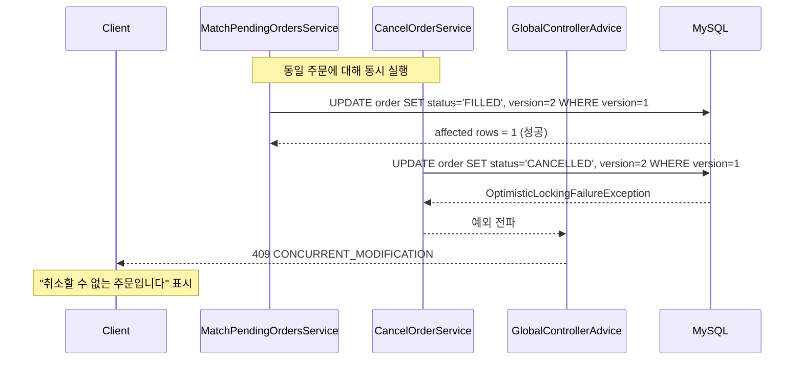

# 개요

미체결(PENDING) 상태인 지정가 주문을 취소한다. 주문 상태를 CANCELLED로 전이하고, lock된 잔고를 해제하며, 매칭 시스템의 로컬 캐시에서 해당 주문을 제거한다.

# 목적

- 사용자가 아직 체결되지 않은 지정가 주문을 철회할 수 있게 한다
- 주문 생성 시 lock된 잔고를 즉시 사용 가능 상태로 복원한다
- 매칭 시스템이 취소된 주문을 체결하지 않도록 로컬 캐시에서 제거한다


# 관련 비즈니스 로직

## 소유권 검증

취소 API에 `walletId`를 함께 전달받아, 주문의 `walletId`와 일치하는지 검증한다. 불일치 시 `ORDER_NOT_FOUND` 예외를 던진다 (주문의 존재 여부를 노출하지 않기 위해 403 대신 404 사용).

## 멱등성

이미 CANCELLED 상태인 주문에 대한 취소 요청은 예외 없이 현재 상태를 그대로 반환한다. 네트워크 재시도나 중복 요청에 안전하다.

## 주문 상태 전이

`Order.cancel()` 도메인 메서드가 상태 전이를 수행한다.

| 현재 상태 | 전이 결과 |
|----------|----------|
| PENDING | → CANCELLED |
| CANCELLED | 멱등하게 반환 (서비스에서 사전 체크) |
| FILLED | `ORDER_NOT_CANCELLABLE` 예외 |
| FAILED | `ORDER_NOT_CANCELLABLE` 예외 |

## 잔고 unlock

주문 생성 시 lock된 잔고를 해제한다. unlock 대상 코인을 결정하기 위해 `exchangeCoinId → coinId` 매핑과 거래소 상세(baseCurrencyCoinId)를 조회한다.

| 주문 | unlock 대상 | 금액 |
|------|------------|------|
| 지정가 매수 | 기준 통화 (KRW/USDT) | 체결금액 + 수수료 (`getSettlementDebit()`) |
| 지정가 매도 | 코인 | 체결수량 (`getQuantity().value()`) |

## 로컬 캐시 제거

트랜잭션 커밋 후 `PendingOrderCachePort.remove(exchangeCoinId, orderId)`를 호출한다.

- 캐시에 없는 주문을 제거하려 해도 예외 없이 무시한다 (다른 서버에서 생성된 주문이거나, 매칭이 먼저 제거한 경우)
- 트랜잭션 커밋 후 제거하는 이유: DB 롤백 시 캐시에서만 제거되어 매칭 기회를 영구히 잃는 것을 방지한다
- 커밋 후 캐시 제거 전 짧은 시간 동안 매칭이 시도되더라도, DB에서 `WHERE status = 'PENDING'` 조건에 걸려 skip되므로 안전하다

## 트랜잭션 범위

주문 상태 변경과 잔고 unlock은 반드시 같은 트랜잭션에서 수행한다. 주문은 CANCELLED인데 잔고가 lock된 상태를 방지한다.

```
@Transactional 범위:
    ├─ 주문 조회 + 소유권 검증
    ├─ order.cancel() — 상태 전이
    ├─ 잔고 unlock
    └─ 주문 저장

@TransactionalEventListener(AFTER_COMMIT):
    └─ 로컬 캐시에서 제거
```

## 매칭과의 동시성 제어

### 낙관적 락

취소 요청과 매칭 체결이 동일 주문에 대해 동시에 발생할 수 있다. `@Version` 없이는 나중에 커밋되는 트랜잭션이 먼저 변경된 상태를 덮어쓸 수 있다 (예: 매칭이 FILLED로 변경했는데 취소가 CANCELLED로 덮어씀).

Order 엔티티에 `@Version`을 추가하여 낙관적 락을 적용한다.

```java
// OrderJpaEntity
@Version
private Long version;
```

- 매칭이 먼저 FILLED로 변경하면 version이 증가한다
- 취소가 이전 version으로 UPDATE를 시도하면 `OptimisticLockingFailureException` 발생
- 이 예외는 `GlobalControllerAdvice`에서 `CONCURRENT_MODIFICATION` (409)로 변환한다
- 취소에서 낙관적 락 충돌은 매칭이 먼저 체결한 경우에만 발생한다
- 프론트엔드는 취소 API에서 409를 수신하면 "취소할 수 없는 주문입니다"로 표시한다

| 전략 | 장점 | 단점 |
|------|------|------|
| 비관적 락 (`SELECT FOR UPDATE`) | 확실한 직렬화 | 매칭은 비동기 고빈도 처리 → 락 대기로 성능 저하 |
| 낙관적 락 (`@Version`) | 충돌 시에만 실패, 정상 경로 성능 영향 없음 | 충돌 시 409 응답 |
| DB 조건 (`WHERE status = 'PENDING'`) | 단순 | 변경 감지와 어울리지 않음, affected rows 확인 불편 |

취소와 매칭의 경합은 극히 드물고(사용자가 체결 직전에 취소 버튼을 누르는 경우), 정상 경로에서는 충돌이 없으므로 낙관적 락이 적합하다.


## 에러 처리

| 상황 | 처리 |
|------|------|
| 주문 없음 | `ORDER_NOT_FOUND` (404) |
| 소유권 불일치 | `ORDER_NOT_FOUND` (404) — 존재 여부 노출 방지 |
| 이미 취소됨 | 멱등하게 현재 상태 반환 (200) |
| FILLED/FAILED 상태 | `ORDER_NOT_CANCELLABLE` (400) |
| 낙관적 락 충돌 | `CONCURRENT_MODIFICATION` (409) — 프론트엔드에서 "취소할 수 없는 주문입니다"로 표시 |
| 캐시 제거 실패 | 무시 (다음 매칭에서 DB 수준 방어) |

# API 명세

`POST /api/orders/{orderId}/cancel`

## Path Parameter

| 필드 | 타입 | 필수 | 설명 |
|------|------|------|------|
| orderId | Long | O | 취소할 주문 ID |

## Request Body

| 필드 | 타입 | 필수 | 설명 |
|------|------|------|------|
| walletId | Long | O | 지갑 ID (소유권 검증용) |

## Request

```
POST /api/orders/42/cancel

{
    "walletId": 1
}
```

## Response

```json
{
    "status": 200,
    "code": "OK",
    "message": "주문이 취소되었습니다.",
    "data": {
        "orderId": 42,
        "status": "CANCELLED"
    }
}
```

## 응답 필드 상세

| 필드 | 타입 | 설명 |
|------|------|------|
| orderId | Long | 취소된 주문 ID |
| status | String | 주문 상태 (`CANCELLED`) |

## 에러 응답

| code | status | 설명 |
|------|--------|------|
| ORDER_NOT_FOUND | 404 | 주문을 찾을 수 없거나 소유권 불일치 |
| ORDER_NOT_CANCELLABLE | 400 | PENDING이 아닌 주문을 취소하려 함 (FILLED, FAILED 등) |
| CONCURRENT_MODIFICATION | 409 | 낙관적 락 충돌 (매칭과 동시 실행). 재시도 시 현재 상태에 따라 처리 |

# 시퀀스 다이어그램

```mermaid
sequenceDiagram
    participant Client
    participant Controller as OrderController
    participant Service as CancelOrderService
    participant OrderPort as OrderCommandPort
    participant MappingUC as FindExchangeCoinMappingUseCase
    participant ExchangeUC as FindExchangeDetailUseCase
    participant Balance as ManageWalletBalanceUseCase
    participant MySQL
    participant Cache as PendingOrderCachePort

    Client->>Controller: POST /api/orders/{orderId}/cancel {walletId}
    Controller->>Service: cancelOrder(command)

    rect rgb(60, 60, 60)
        Note over Service,MySQL: STEP 01 주문 조회 + 검증
    end
    Service->>OrderPort: findById(orderId)
    OrderPort->>MySQL: SELECT order
    OrderPort-->>Service: Order
    Note over Service: 소유권 검증 (walletId 일치)
    Note over Service: 멱등성 체크 (이미 CANCELLED → 반환)
    Note over Service: order.cancel() — PENDING → CANCELLED

    rect rgb(60, 60, 60)
        Note over Service,Balance: STEP 02 잔고 unlock
    end
    Service->>MappingUC: findById(exchangeCoinId)
    MappingUC-->>Service: ExchangeCoinMappingResult

    alt 매수 주문
        Service->>ExchangeUC: findExchangeDetail(exchangeId)
        ExchangeUC-->>Service: ExchangeDetailResult
        Service->>Balance: unlockBalance(walletId, baseCurrencyCoinId, settlementDebit)
    else 매도 주문
        Service->>Balance: unlockBalance(walletId, coinId, quantity)
    end
    Balance->>MySQL: UPDATE wallet_balance

    rect rgb(60, 60, 60)
        Note over Service,MySQL: STEP 03 주문 저장
    end
    Service->>OrderPort: save(order)
    OrderPort->>MySQL: UPDATE order (CANCELLED, version+1)

    rect rgb(60, 60, 60)
        Note over Service,Cache: STEP 04 로컬 캐시 제거 (AFTER_COMMIT)
    end
    Service->>Cache: remove(exchangeCoinId, orderId)

    Service-->>Controller: Order
    Controller-->>Client: 200 OK {orderId, status: CANCELLED}
```



## 낙관적 락 충돌 시


