# 개요
업비트·빗썸·바이낸스와 같은 CEX 거래소의 시장가/지정가 주문을 생성

# 목적
- 사용자가 주문을 생성해서 모의 투자를 진행할 수 있도록 함
- 실제 거래소의 주문처럼 지갑에서 잔고를 조회해 주문 가능 금액을 확인
- 주문 생성 시 투자 원칙 위반 여부를 따져 투자 복기용 그래프를 위한 데이터 마련

# 주문 생성

## 주문 입력 정보

- 매수: 사용자는 주문 금액을 입력한다 (기준 통화). 지정가 매수는 수량 입력도 허용한다
- 매도: 사용자는 주문 수량을 입력한다 (코인). 지정가 매도는 금액 입력도 허용한다
- 국내 거래소: 기준 통화는 KRW이다
- 해외 거래소 (바이낸스):기준 통화는 USDT이다

## 주문 검증

### 주문 금액 제한

| 구분            | 최소 주문 금액  | 최대 주문 금액 |
|---------------|-----------|----------|
| 국내 거래소        | 5,000 KRW | 10억 KRW  |
| 해외 거래소 (바이낸스) | 5 USDT    | 제한 없음    |

### 매수 가능 조건

- 주문 가능 금액 = 기준 통화 잔고 - 송금 예정 금액 - 동결 금액 - 미체결 지정가 매수 주문 점유 금액
- 매수 검증: 실제 체결 금액 + 수수료 ≤ 주문 가능 금액

### 매도 가능 조건

- 주문 가능 수량 = 보유 수량 - 송금 예정 수량 - 동결 수량 - 미체결 지정가 매도 주문 점유 수량
- 매도 검증: 체결 수량 ≤ 주문 가능 수량

## 체결 계산

### 체결 수량

- 코인 체결 수량은 소수점 아래 8자리까지 표현하고 그 이하는 버림 처리한다
- 시장가 매수: 체결 수량 = floor(주문금액 / 현재가, 소수점 8자리)
- 지정가 매수: 체결 수량 = floor(주문금액 / 지정가, 소수점 8자리)
- 이는 시장가에서는 체결가가 현재가이고, 지정가에서는 지정가이기 때문이다.
- 매도: 입력한 주문 수량이 체결 수량이 된다 (소수점 8자리 초과 시 버림 처리)
- 매수 시 버림으로 인해 체결되지 않은 잔여 금액(주문금액 - 실제 체결 금액)은 기준 통화 잔고에 그대로 남는다

### 실제 체결 금액

- 실제 체결 금액 = 체결 수량 × 체결가

### 수수료

- 수수료는 거래소별 전역 수수료율 적용 (거래소마다 고정 요율)
- 수수료 = 실제 체결 기준 통화 금액 × 수수료율

## 시장가 주문

- 부분 체결 없음, 전량 즉시 체결
- 시장가 매수: 매수 가능 조건을 만족하면 현재가로 즉시 전량 체결
- 시장가 매도: 매도 가능 조건을 만족하면 현재가로 즉시 전량 체결
- 체결가는 현재가가 된다

## 지정가 주문

- 부분 체결 없음, 가격 조건 달성 시 전량 체결
- 체결가는 지정가이다
- 지정가 주문은 즉시 체결되지 않으므로, 체결 대기 중 잔고 이중 사용을 방지하기 위해 주문 생성 시점에 잔고를 점유한다
    - 점유된 금액은 사용할 수 없음
    - 매수: 실제 체결 금액 + 수수료를 기준 통화 잔고에서 점유
    - 매도: 체결 수량을 코인 보유 수량에서 점유
- 매수: 현재가 ≤ 지정가이면 체결
- 매도: 현재가 ≥ 지정가이면 체결

## API 명세

### 참고사항

- 클라이언트가 거래소-코인 목록 조회 시 이미 보유한 정보(거래소명, 코인 심볼, 기준 통화 등)는 응답에 포함하지 않는다.
- `exchangeCoinId`로 클라이언트가 로컬 룩업하여 표시한다.

`POST /api/orders`

### 멱등성

- 클라이언트가 `clientOrderId`(String)를 생성하여 전송한다.
- 서버는 동일한 `clientOrderId`로 중복 요청이 들어오면 기존 주문 결과를 반환하고 새 주문을 생성하지 않는다.

### Request Body

| 필드             | 타입         | 필수  | 설명                              |
|----------------|------------|-----|---------------------------------|
| clientOrderId  | String     | O   | 멱등성 키 (클라이언트 생성)                |
| walletId       | Long       | O   | 주문 지갑 ID                        |
| exchangeCoinId | Long       | O   | 거래소-코인 ID                       |
| side           | String     | O   | `BUY` \| `SELL`                 |
| orderType      | String     | O   | `MARKET` \| `LIMIT`             |
| price          | BigDecimal | 조건부 | 지정가 (LIMIT일 때 필수, MARKET일 때 무시) |
| amount         | BigDecimal | O   | 매수: 주문 총액, 매도: 주문 수량            |

#### `amount` 필드 규칙

| side | amount 의미 | 단위                          |
|------|-----------|-----------------------------|
| BUY  | 주문 총액     | 기준 통화 (국내: KRW, 바이낸스: USDT) |
| SELL | 주문 수량     | 코인                          |

### Request

**지정가 매수** — 빗썸에서 BTC를 1억원에 50만원어치 매수

```json
{
  "clientOrderId": "550e8400-e29b-41d4-a716-446655440001",
  "walletId": 2,
  "exchangeCoinId": 7,
  "side": "BUY",
  "orderType": "LIMIT",
  "price": 100000000,
  "amount": 500000
}
```

### Response

```json
{
  "status": 201,
  "code": "CREATED",
  "message": "주문이 체결되었습니다.",
  "data": {
    "orderId": 42,
    "side": "BUY",
    "orderType": "MARKET",
    "orderAmount": 99872.54,
    "quantity": 0.00099726,
    "price": null,
    "filledPrice": 100274000,
    "fee": 49.94,
    "status": "FILLED",
    "createdAt": "2026-02-21T14:30:00",
    "filledAt": "2026-02-21T14:30:00"
  }
}
```

### 에러 응답

| code                     | status | 설명                |
|--------------------------|--------|-------------------|
| INSUFFICIENT_BALANCE     | 400    | 잔고 부족             |
| BELOW_MIN_ORDER_AMOUNT   | 400    | 최소 주문 금액 미달       |
| ABOVE_MAX_ORDER_AMOUNT   | 400    | 최대 주문 금액 초과       |
| PRICE_REQUIRED_FOR_LIMIT | 400    | 지정가 주문 시 price 누락 |
| WALLET_NOT_FOUND         | 404    | 지갑을 찾을 수 없음       |
| EXCHANGE_COIN_NOT_FOUND  | 404    | 거래소-코인을 찾을 수 없음   |

## 시퀀스 다이어그램

```mermaid
sequenceDiagram
    participant Client
    participant Controller as OrderController
    participant Service as PlaceOrderService
    participant ExchangeCoinAdapter
    participant TradingVenueAdapter
    participant RedisAdapter as LivePriceAdapter
    participant WalletAdapter as WalletBalanceAdapter
    participant PrincipleAdapter as InvestmentPrincipleAdapter
    participant OrderAdapter as OrderPersistenceAdapter
    participant Redis
    participant MySQL
    participant Order
    participant InvestmentPrinciple

    Client->>Controller: POST /api/orders
    Controller->>Service: placeOrder(command)

    rect rgb(60, 60, 60)
        Note over Service,MySQL: STEP 01 멱등성 검사
    end
    Service->>OrderAdapter: findByIdempotencyKey(key)
    OrderAdapter->>MySQL: SELECT by idempotency_key

    rect rgb(60, 60, 60)
        Note over Service,MySQL: STEP 02 거래소·코인 정보 조회
    end
    Service->>ExchangeCoinAdapter: findById(exchangeCoinId)
    ExchangeCoinAdapter->>MySQL: SELECT exchange_coin
    Service->>TradingVenueAdapter: findByExchangeId(exchangeId)
    TradingVenueAdapter->>MySQL: SELECT trading_venue

    Note over Service: 전략 결정 (OrderType × Side)

    rect rgb(60, 60, 60)
        Note over Service,Redis: STEP 03 시세 조회 (시장가만)
    end
    Service->>RedisAdapter: getCurrentPrice(exchangeCoinId)
    RedisAdapter->>Redis: GET coin_price

    rect rgb(60, 60, 60)
        Note over Service,Order: STEP 04 주문 생성
    end
    Service->>Order: createMarketBuyOrder(amount, currentPrice, venue)
    Note over Order: 금액 제한 검증 + 체결 수량·수수료 계산
    Order-->>Service: order

    rect rgb(60, 60, 60)
        Note over Service,MySQL: STEP 05 잔고 검증
    end
    Service->>WalletAdapter: getAvailableBalance(walletId, baseCurrencyCoinId)
    WalletAdapter->>MySQL: SELECT available
    Service->>Order: validateSufficientBalance(available)

    rect rgb(60, 60, 60)
        Note over Service,InvestmentPrinciple: STEP 06 투자 원칙 검증
    end
    Service->>PrincipleAdapter: findByRoundId(roundId)
    PrincipleAdapter->>MySQL: SELECT principles
    Service->>InvestmentPrinciple: checkViolation(order)
    InvestmentPrinciple-->>Service: violations

    rect rgb(60, 60, 60)
        Note over Service,MySQL: STEP 07 잔고 변경
    end
    Service->>WalletAdapter: deductBalance(walletId, KRW, settlementDebit)
    Service->>WalletAdapter: addBalance(walletId, BTC, quantity)
    WalletAdapter->>MySQL: UPDATE wallet_balance

    rect rgb(60, 60, 60)
        Note over Service,MySQL: STEP 08 주문·위반 기록 저장
    end
    Service->>OrderAdapter: save(order)
    OrderAdapter->>MySQL: INSERT order
    Service->>PrincipleAdapter: saveViolations(orderId, violations)
    PrincipleAdapter->>MySQL: INSERT violation_record

    Service-->>Controller: Order
    Controller-->>Client: 201 Created
```


