# 개요

지정가 주문이 생성되면 PENDING 상태로 대기한다. 실시간 시세가 체결 조건에 도달하면 해당 주문을 FILLED로 전이시키고 잔고를 반영한다. 이 과정을 "미체결 주문 매칭"이라 한다.

# 선행 구현 사항

- 지정가 주문 생성 (cex-order.md) — PENDING 상태 주문 생성, 잔고 lock 처리
- 실시간 시세 수집 (realtime-ticker.md) — 외부 시세 수집기가 Redis에 적재, RabbitMQ로 시세 변경 이벤트 발행

# 전체 흐름

```
[지정가 주문 생성]                    [시세 수신 및 이벤트 발행]
User → Nginx → Server A              시세 수집기 → Upbit/Bithumb/Binance WebSocket
                │                                    │
        MySQL에 PENDING 저장                   Redis에 현재가 갱신
                │                                    │
   Server A 로컬 캐시에 적재              RabbitMQ에 시세 변경 이벤트 발행
                                                     │
                                          Fanout → 모든 서버에 브로드캐스트
                                                     │
                                    ┌────────────────┼────────────────┐
                                Server A          Server B          Server C
                              (주문 있음)         (주문 없음)        (주문 없음)
                                    │                │                │
                     exchange + symbol →   exchange + symbol →  exchange + symbol →
                     exchangeCoinId 변환   exchangeCoinId 변환  exchangeCoinId 변환
                                    │                │                │
                          로컬 캐시에서          해당 코인 주문       해당 코인 주문
                          매칭 대상 조회          없음 → skip        없음 → skip
                                    │
                         체결 조건 충족 시
                              │
                    MySQL 주문 FILLED 변경
                    + 잔고 unlock → 반영
                    + Holding 갱신
                              │
                    로컬 캐시에서 제거
```

# 로컬 캐시 구조

## 적재 대상

PENDING 상태인 지정가 주문. 로컬 캐시에는 매칭 판정에 필요한 최소 정보만 적재한다.

## 캐시 키

`exchangeCoinId`(거래소-코인 ID)를 키로 사용한다. 시세 변경 이벤트 수신 시 해당 코인의 미체결 주문 리스트를 O(1)로 조회하기 위함이다.

## 자료구조

```
ConcurrentHashMap<Long, CopyOnWriteArrayList<PendingOrder>>
     exchangeCoinId →  해당 코인의 미체결 주문 리스트
```

- `ConcurrentHashMap`: 시세 이벤트 수신(읽기)과 주문 생성/취소(쓰기)가 동시에 발생하므로 thread-safe 자료구조 사용
- `CopyOnWriteArrayList`: 읽기(매칭 순회)가 쓰기(주문 추가/제거)보다 훨씬 빈번하므로 읽기 최적화된 자료구조 사용. 시세 이벤트마다 순회가 발생하지만 주문 추가/제거는 상대적으로 드물다

## PendingOrder (캐시 항목)

매칭 판정에 필요한 최소 정보만 보유한다. 체결 시 DB에서 전체 주문을 조회하여 처리한다.

| 필드 | 타입 | 설명 |
|------|------|------|
| orderId | Long | 주문 ID (DB PK) |
| exchangeCoinId | Long | 거래소-코인 ID |
| side | Side | BUY / SELL |
| price | BigDecimal | 지정가 |

## 캐시 생명주기

| 이벤트 | 캐시 동작 |
|--------|----------|
| 지정가 주문 생성 | DB 저장 후 로컬 캐시에 추가 |
| 매칭 체결 | 로컬 캐시에서 제거 |
| 주문 취소 | 로컬 캐시에서 제거 |
| 서버 재시작 | DB에서 전체 미체결 주문 워밍업 |

# 시세 변경 이벤트

## RabbitMQ 토폴로지

```
시세 수집기
    │
    ▼
[Fanout Exchange: ticker.exchange]
    │
    ├─→ Queue: ticker.trading.server-1  →  Server 1
    ├─→ Queue: ticker.trading.server-2  →  Server 2
    └─→ Queue: ticker.trading.server-3  →  Server 3
```

- **Fanout Exchange**: 모든 서버가 동일한 시세 이벤트를 수신해야 하므로 Fanout 사용
- **서버별 전용 큐**: 각 서버가 자기만의 큐를 가지며, 서버가 내려가면 큐에 메시지가 쌓이고 서버 복구 시 처리
- marketdata용 `ticker.marketdata.{uuid}` 큐도 동일 fanout exchange에 바인딩되어 독립적으로 시세를 소비한다

### 메시지 신뢰성

**생산자 (시세 수집기)**
- Publisher Confirms를 사용하여 브로커 수신을 확인한다. ack을 받지 못하면 재시도한다
- 재시도로 동일 시세가 중복 발행될 수 있으나, 소비자가 멱등하게 처리하므로 문제없다

**소비자 (트레이딩 서버)**
- 메시지 수준에서는 requeue하지 않고 항상 ack 처리한다. requeue하면 큐 뒤로 밀려 최신 시세 처리를 지연시키고, 동일 예외가 반복되면 poison message가 된다
- 체결 처리(`fillOrder`)에 한해 서비스 내부에서 즉시 재시도한다 (최대 2회, 50ms → 100ms backoff)
- 하나의 시세 이벤트에 여러 주문이 매칭될 수 있으므로, 메시지 전체를 requeue하지 않고 실패한 체결만 개별 재시도한다. 이렇게 해야 이미 성공한 체결을 다시 처리하지 않는다

- 실패 유형별 재시도 전략은 아래 "매칭 실패 및 예외 처리" 참조

## 시세 변경 이벤트 메시지

| 필드 | 타입 | 설명                              |
|------|------|---------------------------------|
| exchange | String | 거래소 명 (UPBIT, BITHUMB, BINANCE) |
| symbol | String | 거래 페어 (BTC/KRW, ETH/USDT)       |
| currentPrice | BigDecimal | 변경된 현재가                         |
| timestamp | Long | 시세 수신 시각 (epoch ms)             |

- 시세 수집기는 별도 서버이므로 트레이딩 서버의 DB 스키마(`exchangeCoinId`)를 알지 못한다. 시세 수집기가 아는 정보(거래소, 심볼)만 메시지에 포함한다
- 이벤트 수신 서버(트레이딩 서버)에서 `exchange + symbol → exchangeCoinId` 매핑을 로컬 캐시로 변환한 후 매칭에 사용한다

## 거래소-코인 매핑 캐시

시세 이벤트의 `exchange + symbol`을 로컬 캐시 키인 `exchangeCoinId`로 변환하기 위한 로컬 캐시.

### 자료구조

```
ConcurrentHashMap<ExchangeSymbolKey, Long>
    (exchange, symbol) → exchangeCoinId
```

### 생명주기

| 이벤트 | 동작 |
|--------|------|
| 서버 시작 | DB에서 전체 거래소-코인 매핑 로딩 |
| 코인 상장/상폐 | 캐시 갱신 |

- 거의 변하지 않는 정적 데이터이므로 서버 시작 시 전체 로딩 후 인메모리로 유지한다
- 매 시세 이벤트마다 조회하므로 네트워크 I/O가 없는 로컬 캐시를 사용한다

# 매칭 로직

## 체결 조건

| 주문 | 체결 조건 |
|------|----------|
| 지정가 매수 | 현재가 ≤ 지정가 |
| 지정가 매도 | 현재가 ≥ 지정가 |

## 체결 처리

체결 조건을 만족한 주문에 대해 다음을 수행한다.

### 1. 주문 상태 변경

- DB에서 주문을 조회한다
- 주문 상태를 PENDING → FILLED로 변경한다
- `filledAt`을 현재 시각으로 설정한다
- DB에 반영한다

### 2. 잔고 반영

주문 생성 시 lock된 잔고를 해제하고, 체결 결과를 반영한다.

| 주문 | lock 해제 | 체결 반영 |
|------|----------|----------|
| 지정가 매수 | 기준 통화 unlock (체결금액 + 수수료) | 기준 통화 deduct (체결금액 + 수수료) + 코인 add (체결수량) |
| 지정가 매도 | 코인 unlock (체결수량) | 코인 deduct (체결수량) + 기준 통화 add (체결금액 - 수수료) |

- unlock + deduct를 분리하는 이유: `available`과 `locked` 잔고를 명확하게 추적하기 위함
- 체결가는 지정가와 동일하다 (주문 생성 시 이미 계산된 `filledPrice` = `price`)

### 3. Holding 갱신

- 매수 체결: Holding의 평균 매수가, 보유 수량, 물타기 횟수를 갱신한다
- 매도 체결: Holding의 보유 수량을 감소시킨다. 전량 매도 시 0으로 리셋한다
- 기존 `Holding.applyOrder(side, filledPrice, quantity, currentPrice)` 메서드를 재사용한다

### 4. 클라이언트 체결 이벤트 발행

트랜잭션 커밋 후 STOMP를 통해 해당 사용자에게 체결 이벤트를 푸시한다.

- STOMP user destination: `/user/queue/events`
- 메시지: `{eventType: "ORDER_FILLED", walletId, orderId, coinId, side, quantity, price, fee}`
- `@TransactionalEventListener(phase = AFTER_COMMIT)`으로 트랜잭션 커밋 후 발행한다
- 클라이언트는 현재 보고 있는 walletId와 일치할 때만 로컬 갱신한다
  - 포트폴리오 탭: 해당 holding만 로컬 갱신 (매수: qty 증가 + avgBuyPrice 재계산 + 잔고 차감, 매도: qty 감소 + 잔고 증가) → 자산요약 재계산
  - 입출금 탭: 해당 coinId 잔고만 로컬 갱신 (available/locked 조정)

#### WebSocket 설정 변경

현재 `WebSocketConfig`는 `/topic` 브로커만 등록되어 있다. user destination(`/user/queue/events`)을 사용하려면 다음을 추가한다.

- `enableSimpleBroker("/topic", "/queue")` — `/queue` 브로커 추가
- `registry.setUserDestinationPrefix("/user")` — user destination 접두사 설정

## 트랜잭션 범위

하나의 체결 처리(주문 상태 변경 + 잔고 반영 + Holding 갱신)는 단일 트랜잭션으로 묶는다.

- 주문은 FILLED인데 잔고가 반영 안 된 상태를 방지
- 체결 처리 중 예외 발생 시 전체 롤백하고 로컬 캐시에 주문을 다시 추가한다
- 클라이언트 이벤트 발행은 트랜잭션 밖(AFTER_COMMIT)에서 수행하므로, 이벤트 발행 실패가 체결을 롤백하지 않는다

# 동시성 제어

## 정상 상태: 중복 체결 불가능

주문은 생성한 서버의 로컬 캐시에만 존재하므로, 여러 서버가 같은 주문을 동시에 매칭하는 상황 자체가 발생하지 않는다.

## 취소와의 경합: 낙관적 락

주문 취소와 매칭 체결이 동일 주문에 대해 동시에 발생할 수 있다. Order 엔티티의 `@Version`(낙관적 락)으로 방어한다.

- 취소가 먼저 CANCELLED로 변경하면 version이 증가한다
- 매칭이 이전 version으로 UPDATE를 시도하면 `OptimisticLockingFailureException` 발생
- 매칭은 이 예외를 catch하여 캐시 재추가 없이 skip한다 (취소가 이미 처리했으므로)

## 서버 재시작 시: 낙관적 락으로 방어

서버 재시작 시 DB에서 전체 미체결 주문을 워밍업하므로, 일시적으로 여러 서버에 같은 주문이 존재할 수 있다. 먼저 체결한 서버가 version을 증가시키므로, 나중에 체결을 시도하는 서버는 `OptimisticLockingFailureException`을 받아 skip한다.

## 동일 서버 내 동시 매칭

빠르게 연속된 시세 이벤트가 같은 주문에 대해 동시에 체결 조건을 만족시킬 수 있다.

- 로컬 캐시에서 주문을 제거하는 시점을 체결 조건 판정 직후(DB 처리 전)로 설정한다
- 첫 번째 이벤트가 캐시에서 제거하면 두 번째 이벤트는 캐시에서 찾지 못해 skip된다
- 만약 체결 처리가 실패(예외)하면 캐시에 다시 추가한다

# 서버 재시작 워밍업

## 워밍업 시점

`ApplicationReadyEvent` 시점에 두 가지 캐시를 초기화한다. RabbitMQ 리스너는 워밍업 완료 후 시세 이벤트를 소비하기 시작한다.

## 워밍업 순서

1. 서버 시작
2. 거래소-코인 매핑 캐시 로딩 (DB에서 전체 매핑 조회)
3. 미체결 주문 캐시 로딩 (DB에서 PENDING 주문 조회)
4. RabbitMQ 리스너 활성화 → 시세 이벤트 소비 시작

- 매핑 캐시를 먼저 로딩해야 시세 이벤트 수신 시 `exchange + symbol → exchangeCoinId` 변환이 가능하다
- 워밍업 중 들어온 시세 이벤트는 큐에 쌓여있다가 리스너 활성화 후 소비된다. 워밍업 전에 체결 조건에 도달했던 주문도 다음 시세 이벤트에서 매칭된다

## 미체결 주문 워밍업 쿼리

```sql
SELECT order_id, exchange_coin_id, side, price
FROM orders
WHERE status = 'PENDING'
```

- 매칭 판정에 필요한 최소 컬럼만 조회한다
- 전체 미체결 주문을 한 번에 조회한다 (주문 수가 서버당 수천~수만 수준으로 관리 가능)

# 매칭 실패 및 예외 처리

| 상황 | 재시도 | 처리 |
|------|--------|------|
| 매핑 변환 실패 (캐시 미초기화 등) | X | 구조적 문제. 로그 경고 후 종료 |
| DB에서 주문 조회 실패 (삭제됨) | X | 로컬 캐시에서 제거, 로그 경고 |
| 낙관적 락 충돌 (취소·다른 서버 매칭) | X | 캐시 재추가 없이 skip. 다른 트랜잭션이 이미 처리 |
| 체결 처리 DB 실패 (커넥션, 데드락) | O (최대 2회) | 50ms → 100ms backoff 후 재시도 |
| 재시도 소진 | X | 트랜잭션 롤백, 로컬 캐시에 주문 재추가, DB에 실패 이력 기록, 로그 경고 |
| RabbitMQ 연결 끊김 | - | 큐에 메시지 쌓임, 재연결 후 소비. 체결 지연 발생 |

## 체결 실패 이력

재시도가 소진된 체결은 DB에 실패 이력을 기록한다. 가격이 다시 체결 조건에 도달하면 자연 재시도되지만, 가격이 돌아오지 않으면 체결 기회를 영구히 놓칠 수 있다.

### 기록 항목

| 필드 | 타입 | 설명 |
|------|------|------|
| orderId | Long | 체결 실패한 주문 ID |
| attemptedPrice | BigDecimal | 체결을 시도한 시세 |
| failedAt | LocalDateTime | 실패 시각 |
| reason | String | 실패 사유 (예: DB 커넥션 타임아웃) |
| resolved | boolean | 이후 체결 성공 여부 (기본값 false) |

### 보상 스케줄러

주기적으로(1분 간격) 미해결(`resolved = false`) 실패 이력을 조회하여 체결을 재시도한다.

- 주문이 이미 FILLED/CANCELLED이면 `resolved = true`로 갱신하고 skip한다 (캐시 재추가 후 자연 재시도로 이미 체결된 경우)
- 주문이 PENDING이면 `fillOrder` 호출하여 체결 처리한다 (체결 조건은 실패 이력의 `attemptedPrice`로 이미 검증됨)
- 체결 성공 시 `resolved = true`로 갱신한다
- 보상 스케줄러는 정상 흐름의 백업이다. 대부분의 체결은 다음 시세 이벤트에서 자연 재시도로 처리된다

# 크로스 컨텍스트 의존

| UseCase | 용도 |
|---------|------|
| `ManageWalletBalanceUseCase` | unlock + deduct + add 잔고 반영 |
| `FindExchangeCoinMappingUseCase` | exchangeCoinId → coinId 매핑 (Holding 갱신에 필요) |
| `FindExchangeDetailUseCase` | baseCurrencyCoinId 조회 (잔고 반영 대상 코인 식별) |
| `GetWalletOwnerIdUseCase` | walletId → userId 조회 (STOMP user destination 라우팅에 필요) |

# 시퀀스 다이어그램

```mermaid
sequenceDiagram
    participant Ticker as 시세 수집기
    participant RabbitMQ
    participant Listener as TickerEventListener
    participant Service as MatchPendingOrdersService
    participant MappingPort as ExchangeCoinMappingCachePort
    participant Cache as PendingOrderCachePort
    participant OrderPort as OrderCommandPort
    participant Balance as ManageWalletBalanceUseCase
    participant HoldingPort as HoldingCommandPort
    participant MySQL
    participant STOMP as SimpMessagingTemplate

    Note over Ticker,RabbitMQ: 시세 변경 이벤트 발행
    Ticker->>RabbitMQ: publish(exchange, symbol, currentPrice)
    RabbitMQ->>Listener: consume (Fanout → 서버별 전용 큐)

    Listener->>Service: matchOrders(exchange, symbol, currentPrice)

    rect rgb(60, 60, 60)
        Note over Service,MappingPort: STEP 00 exchange + symbol → exchangeCoinId 변환
    end
    Service->>MappingPort: resolve(exchange, symbol)
    MappingPort-->>Service: exchangeCoinId

    alt 매핑 없음
        Note over Service: 종료 (알 수 없는 코인)
    end

    rect rgb(60, 60, 60)
        Note over Service,Cache: STEP 01 매칭 대상 조회 (인메모리)
    end
    Service->>Cache: findMatchedOrders(exchangeCoinId, currentPrice)
    Cache-->>Service: List<PendingOrder>

    alt 매칭 대상 없음
        Note over Service: 종료 (I/O 없음)
    end

    loop 매칭된 주문마다
        rect rgb(60, 60, 60)
            Note over Service,Cache: STEP 02 캐시에서 즉시 제거
        end
        Service->>Cache: remove(exchangeCoinId, orderId)

        rect rgb(60, 60, 60)
            Note over Service,MySQL: STEP 03 체결 처리 (@Transactional)
        end
        Service->>OrderPort: findById(orderId)
        OrderPort->>MySQL: SELECT order
        OrderPort-->>Service: Order

        Note over Service: order.fill(now)

        Service->>Balance: unlockBalance + deductBalance + addBalance
        Balance->>MySQL: UPDATE wallet_balance

        Service->>HoldingPort: findByWalletIdAndCoinId + save
        HoldingPort->>MySQL: SELECT + UPDATE holding

        Service->>OrderPort: save(order)
        OrderPort->>MySQL: UPDATE order (FILLED)

        rect rgb(60, 60, 60)
            Note over Service,STOMP: STEP 04 클라이언트 이벤트 (AFTER_COMMIT)
        end
        Service->>STOMP: convertAndSendToUser(userId, /queue/events, ORDER_FILLED)
    end

    Service-->>Listener: void
```



