# 개요

지정가 주문이 생성되면 PENDING 상태로 대기한다. 실시간 시세가 체결 조건에 도달하면 해당 주문을 FILLED로 전이시키고 잔고를 반영한다. 이 과정을 "미체결 주문 매칭"이라 한다.

# 선행 구현 사항

- 지정가 주문 생성 (cex-order.md) — PENDING 상태 주문 생성, 잔고 lock 처리
- 실시간 시세 수집 (realtime-ticker.md) — 외부 수집기가 Redis에 적재하고 RabbitMQ fanout exchange로 시세 이벤트 발행

# 아키텍처 개요

매칭은 수집기(trypto-collector)가 담당하고, 체결 처리는 백엔드(trypto-api)가 담당한다.

- **수집기**: 시세 수신 시 Redis ZSet에서 체결 조건을 만족하는 미체결 주문을 찾아 `matched.orders` 큐로 발행한다
- **백엔드**: `matched.orders` 큐를 소비하여 주문 상태 변경, 잔고 반영, Holding 갱신을 수행한다

```
[지정가 주문 생성]                            [시세 수신 및 매칭]
User → Nginx → Server A                     시세 수집기 → Upbit/Bithumb/Binance WebSocket
                │                                               │
        MySQL에 PENDING 저장                              Redis에 현재가 갱신
                │                                               │
   Redis ZSet에 미체결 주문 적재                   Redis ZSet에서 체결 조건 매칭
                                                                │
                                                  매칭된 주문 → RabbitMQ matched.orders
                                                                │
                                              ┌─────────────────┼─────────────────┐
                                          Server A          Server B          Server C
                                              │ (경쟁 소비 — 하나만 처리)
                                              │
                                    주문 상태 변경 PENDING → FILLED
                                    + 잔고 반영
                                    + Holding 갱신
                                              │
                                    Redis ZSet에서 제거 (수집기)
```

# Redis 미체결 주문 캐시

## 적재 대상

PENDING 상태인 지정가 주문. 매칭 판정에 필요한 최소 정보만 적재한다.

## 자료구조

Redis Sorted Set (ZSet)을 사용한다. 지정가(price)를 score로 저장하여 가격 범위 조회를 수행한다.

## 키 포맷

```
pending:orders:{EXCHANGE}:{BASE}/{QUOTE}:{SIDE}
```

예: `pending:orders:UPBIT:BTC/KRW:BUY`, `pending:orders:BINANCE:ETH/USDT:SELL`

## ZSet 멤버

`orderId`(문자열)를 멤버로, `price`(double)를 score로 저장한다.

## 캐시 생명주기

| 이벤트 | 캐시 동작 | 주체 |
|--------|----------|------|
| 지정가 주문 생성 | Redis ZSet에 ZADD | 백엔드 |
| 매칭 체결 | Redis ZSet에서 ZREM | 수집기 |
| 주문 취소 | Redis ZSet에서 ZREM | 백엔드 |
| 백엔드 서버 재시작 | DB에서 전체 미체결 주문을 Redis에 워밍업 | 백엔드 |
| 수집기 Redis 복구 | DB에서 전체 미체결 주문을 Redis에 워밍업 | 수집기 |

## Redis 장애 대응

백엔드의 Redis 명령은 `@Retryable`로 일시적 장애에 대응한다 (최대 3회, 100ms backoff).

# RabbitMQ 토폴로지


## 매칭된 주문 이벤트

```
시세 수집기 (PendingOrderMatcher)
    │
    ▼
[Direct Exchange: matched.orders]
    │
    ▼
[Quorum Queue: matched.orders]  →  MatchedOrderEventListener
    │                                   │
    │                          Main RetryTemplate (3회, 100ms→500ms)
    │                                   │
    │                            실패 시 개별 아이템을
    │                            retry 큐로 발행
    │                                   │
    ▼                                   ▼
[Quorum Queue: matched.orders.retry]  →  RetryTier Listener
    │                                        │
    │                               Retry RetryTemplate (4회, 2s→8s)
    │                                        │
    │                                  실패 시 DLQ로 발행
    │                                        │
    ▼                                        ▼
[Quorum Queue: matched.orders.dlq]  ←  [Fanout Exchange: matched.orders.dlx]
```

### 메시지 형식

```json
{
  "matched": [
    { "orderId": 12345, "filledPrice": "50000.00" },
    { "orderId": 12346, "filledPrice": "50000.00" }
  ]
}
```

### 재시도 전략

| 단계 | 큐 | 최대 시도 | 백오프 | 동시성 |
|------|-----|----------|--------|--------|
| Main | matched.orders | 3회 | 100ms, 500ms, 500ms (5x multiplier) | 기본 |
| Retry | matched.orders.retry | 4회 | 2s, 4s, 8s (2x multiplier) | 1 (순차 처리) |
| DLQ | matched.orders.dlq | — | — | — |

- Main 큐에서 메시지 단위로 수신하고, 내부의 `matched` 리스트를 순회하며 개별 체결 처리한다
- 개별 아이템 체결 실패 시 해당 아이템만 retry 큐로 발행한다 (성공한 아이템은 재처리하지 않음)
- Retry 큐는 concurrency=1, prefetch=1로 순차 처리하여 하류 시스템 부하를 제한한다
- DLQ는 quorum 큐이며 `x-delivery-limit: 2`로 안전장치를 둔다

# 체결 처리 (백엔드)

체결 조건을 만족한 주문에 대해 다음을 수행한다.

## 1. 주문 상태 변경

매칭된 주문의 상태를 체결됨으로 변경한다.

## 2. 잔고 반영

주문 생성 시 lock된 잔고를 해제하고, 체결 결과를 반영한다. 모든 잔고 변경은 QueryDSL CAS UPDATE로 수행한다.

| 주문 | lock 해제 | 체결 반영 |
|------|----------|----------|
| 지정가 매수 | 기준 통화 unlock (체결금액 + 수수료) | 기준 통화 deduct (체결금액 + 수수료) + 코인 add (체결수량) |
| 지정가 매도 | 코인 unlock (체결수량) | 코인 deduct (체결수량) + 기준 통화 add (체결금액 - 수수료) |

- 체결가는 수집기가 매칭 시점에 전달한 `filledPrice`를 사용한다

## 3. Holding 갱신

Holding은 평균 매수가 계산 등 읽기-수정-쓰기가 필요하므로 SELECT FOR UPDATE 비관적 락을 사용한다.

- 매수 체결: Holding의 평균 매수가, 보유 수량, 물타기 횟수를 갱신한다
- 매도 체결: Holding의 보유 수량을 감소시킨다. 전량 매도 시 0으로 리셋한다
- 신규 Holding 생성 시 유니크 제약조건(`wallet_id, coin_id`) 위반이 발생하면 재조회 후 갱신한다

## 4. 클라이언트 체결 이벤트 발행

트랜잭션 커밋 후 STOMP를 통해 해당 사용자에게 체결 이벤트를 푸시한다.

- STOMP user destination: `/user/queue/events`
- 메시지: `{eventType: "ORDER_FILLED", walletId, orderId, coinId, side, quantity, price, fee}`
- `@TransactionalEventListener(phase = AFTER_COMMIT)`으로 트랜잭션 커밋 후 발행한다
- 클라이언트는 현재 보고 있는 walletId와 일치할 때만 로컬 갱신한다
  - 포트폴리오 탭: 해당 holding만 로컬 갱신 (매수: qty 증가 + avgBuyPrice 재계산 + 잔고 차감, 매도: qty 감소 + 잔고 증가) → 자산요약 재계산
  - 입출금 탭: 해당 coinId 잔고만 로컬 갱신 (available/locked 조정)

### WebSocket 설정 변경

현재 `WebSocketConfig`는 `/topic` 브로커만 등록되어 있다. user destination(`/user/queue/events`)을 사용하려면 다음을 추가한다.

- `enableSimpleBroker("/topic", "/queue")` — `/queue` 브로커 추가
- `registry.setUserDestinationPrefix("/user")` — user destination 접두사 설정

## 트랜잭션 범위

하나의 체결 처리(주문 CAS UPDATE + 잔고 반영 + Holding 갱신)는 단일 트랜잭션으로 묶는다.

# 동시성 제어

## 중복 체결 방지: CAS UPDATE

`matched.orders` 큐는 경쟁 소비(competing consumers) 구조이므로 여러 서버가 같은 메시지를 받지 않는다. 하지만 재시도(retry 큐)나 보상 스케줄러에 의해 같은 주문이 여러 번 체결 시도될 수 있다.

CAS UPDATE(`WHERE status = 'PENDING'`)로 방어한다.
- 첫 번째 시도가 CAS 성공하면 status가 FILLED로 변경된다
- 이후 시도는 `WHERE status = 'PENDING'` 조건에 맞지 않아 affected rows = 0 → skip

## 취소와의 경합: CAS UPDATE

주문 취소와 매칭 체결이 동일 주문에 대해 동시에 발생할 수 있다. 양쪽 모두 CAS UPDATE(`WHERE status = 'PENDING'`)를 사용하므로 하나만 성공한다.

- 체결이 먼저 성공하면: 취소의 CAS UPDATE가 실패 → `ORDER_NOT_CANCELLABLE` 응답
- 취소가 먼저 성공하면: 체결의 CAS UPDATE가 실패 → skip (로그만 남김)

## Wallet 잔고 동시성: CAS UPDATE

잔고 변경은 `WHERE available >= amount` 조건이 포함된 CAS UPDATE로 원자적으로 수행된다. 동시 체결이 같은 잔고를 변경해도 DB 레벨에서 직렬화된다.

- `addBalance`는 잔고 레코드가 없을 때 INSERT를 시도하며, 유니크 제약조건(`wallet_id, coin_id`) 위반 시 UPDATE로 재시도한다

## Holding 동시성: SELECT FOR UPDATE

Holding은 평균 매수가 계산(읽기-수정-쓰기)이 필요하므로 비관적 락을 사용한다.

- `findForUpdateByWalletIdAndCoinId`로 SELECT FOR UPDATE를 수행한다
- 신규 Holding INSERT 시 유니크 제약조건(`wallet_id, coin_id`) 위반이 발생하면 재조회 후 갱신한다

# 서버 재시작 워밍업

## 백엔드 워밍업

`ApplicationReadyEvent` 시점에 DB의 전체 PENDING 주문을 Redis ZSet에 적재한다.

**워밍업 순서:**

각 컨텍스트가 독립적으로 워밍업하고 자기 RabbitMQ 리스너를 시작한다.

**marketdata (MarketdataWarmupInitializer)**
1. `WarmupExchangeCoinMappingUseCase.warmup()` — exchange+symbol → ExchangeCoinMapping 캐시 로딩
2. `tickerMarketdataListener` 시작 → WebSocket 브로드캐스트 시작

**trading (PendingOrderMatchingWarmupInitializer)**
1. `WarmupPendingOrderMatchingUseCase.warmup()` — DB에서 PENDING 주문을 Redis ZSet에 적재
2. `matched.orders` 리스너 시작 → 체결 처리 시작

- 워밍업은 QueryDSL 프로젝션으로 `id, exchangeCoinId, side, price` 최소 컬럼만 조회한다
- Redis 적재는 파이프라인 명령으로 일괄 처리한다
- 워밍업 실패 시 로그만 남기고 서버 기동을 중단하지 않는다


# 크로스 컨텍스트 의존

| UseCase | 용도 |
|---------|------|
| `ManageWalletBalanceUseCase` | unlock + deduct + add 잔고 반영 |
| `FindExchangeCoinMappingUseCase` | exchangeCoinId → coinId 매핑 (Holding 갱신에 필요) |
| `FindExchangeDetailUseCase` | baseCurrencyCoinId 조회 (잔고 반영 대상 코인 식별) |
| `GetWalletOwnerIdUseCase` | walletId → userId 조회 (STOMP user destination 라우팅에 필요) |

# 시퀀스 다이어그램

```mermaid
sequenceDiagram
    participant Collector as 시세 수집기
    participant Redis
    participant RabbitMQ
    participant Listener as MatchedOrderEventListener
    participant Service as FillPendingOrderService
    participant OrderPort as OrderCommandPort
    participant Balance as ManageWalletBalanceUseCase
    participant HoldingPort as HoldingCommandPort
    participant MySQL
    participant STOMP as SimpMessagingTemplate

    Note over Collector,Redis: 시세 수신 및 매칭
    Collector->>Redis: ZRANGEBYSCORE (체결 조건 매칭)
    Redis-->>Collector: matched orderIds

    Collector->>RabbitMQ: publish(MatchedOrderMessage)
    Note over Collector: Publisher Confirms ACK 대기
    Collector->>Redis: ZREM (매칭된 주문 제거)

    RabbitMQ->>Listener: consume (matched.orders 큐)

    loop 매칭된 주문마다
        Listener->>Service: fillOrder(orderId, filledPrice)

        rect rgb(60, 60, 60)
            Note over Service,MySQL: STEP 01 CAS UPDATE (주문 상태 변경)
        end
        Service->>OrderPort: fillOrder(orderId, filledAt)
        OrderPort->>MySQL: UPDATE orders SET status='FILLED' WHERE status='PENDING'

        alt CAS 실패 (이미 처리됨)
            Note over Service: skip (로그만 남김)
        end

        rect rgb(60, 60, 60)
            Note over Service,MySQL: STEP 02 체결된 주문 조회
        end
        Service->>OrderPort: getById(orderId)
        OrderPort->>MySQL: SELECT order
        OrderPort-->>Service: Order

        rect rgb(60, 60, 60)
            Note over Service,MySQL: STEP 03 잔고 반영 (CAS UPDATE)
        end
        Service->>Balance: unlockBalance + deductBalance + addBalance
        Balance->>MySQL: CAS UPDATE wallet_balance

        rect rgb(60, 60, 60)
            Note over Service,MySQL: STEP 04 Holding 갱신 (SELECT FOR UPDATE)
        end
        Service->>HoldingPort: findForUpdate + save
        HoldingPort->>MySQL: SELECT FOR UPDATE + UPDATE holding

        rect rgb(60, 60, 60)
            Note over Service,STOMP: STEP 05 클라이언트 이벤트 (AFTER_COMMIT)
        end
        Service->>STOMP: convertAndSendToUser(userId, /queue/events, ORDER_FILLED)
    end

    Listener-->>RabbitMQ: ack
```


